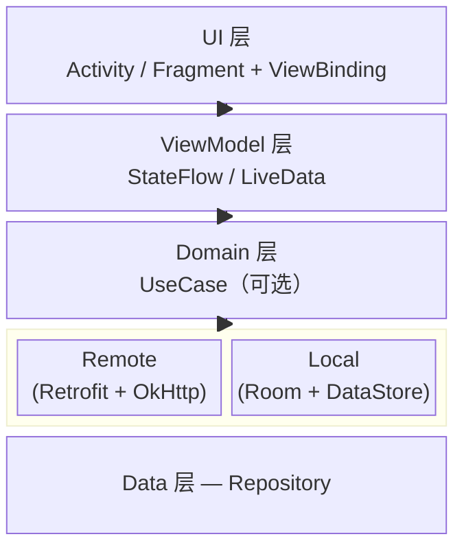
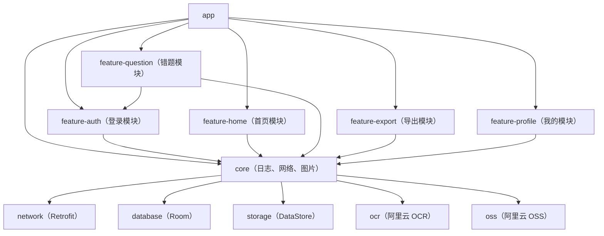
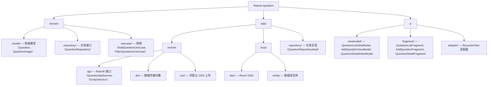
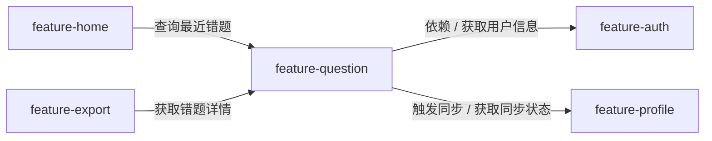
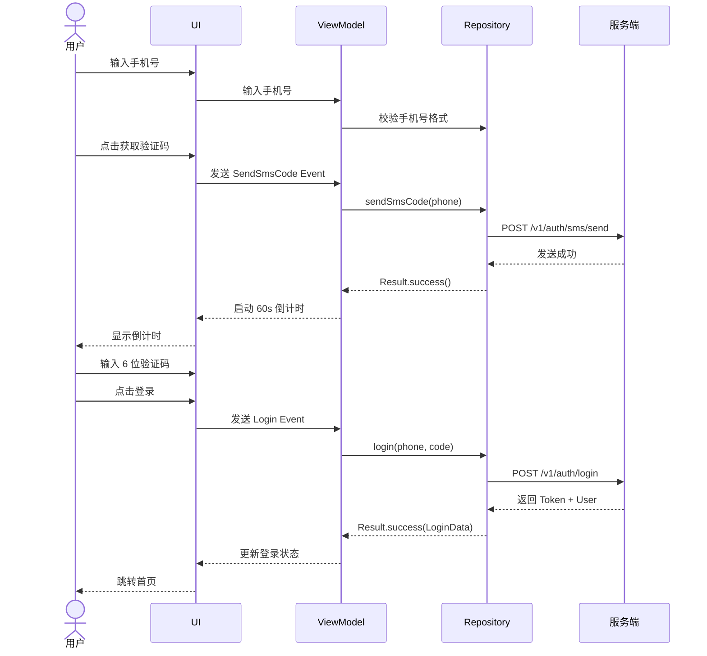
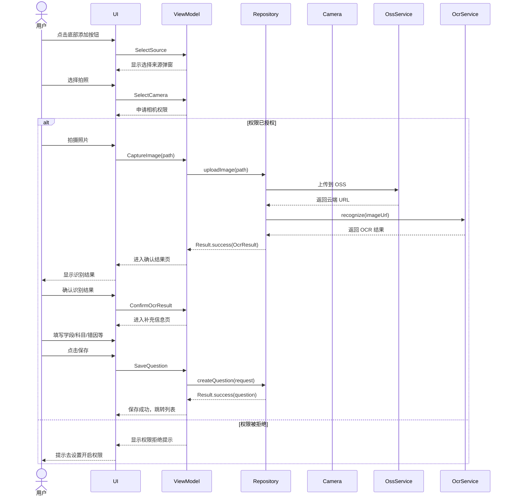
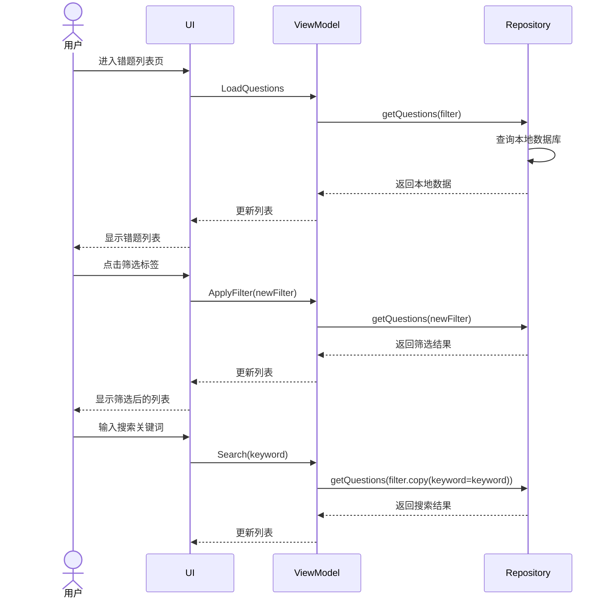
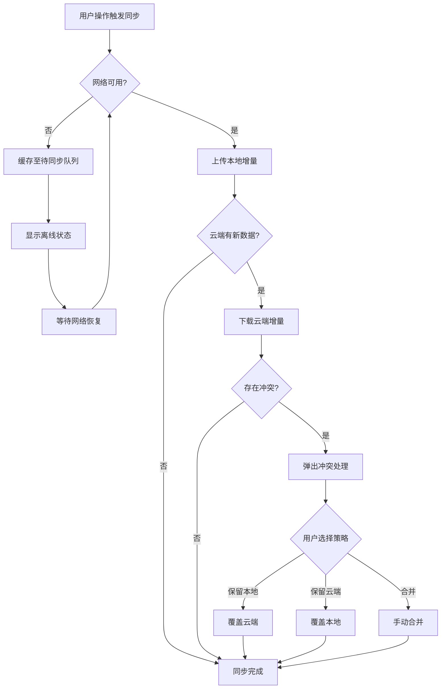
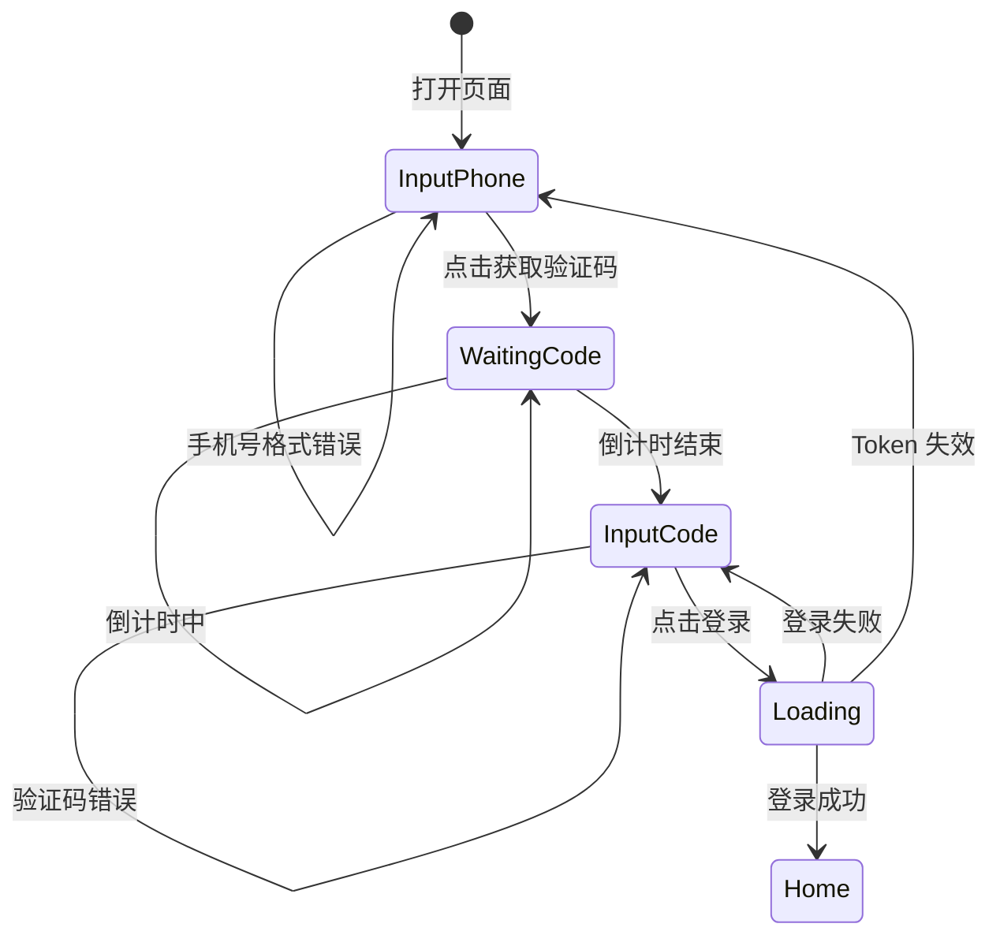
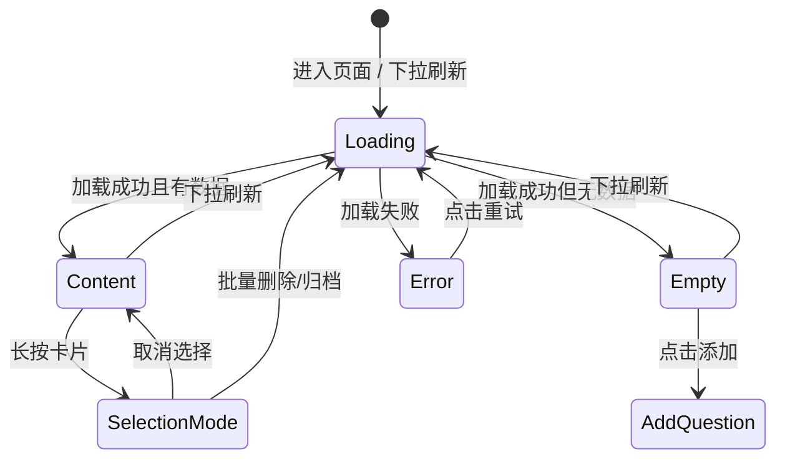

# 状元错题集 Android 技术设计文档

**文档版本**：v1.0  
**创建日期**：2026/06/13  
**作者**：AI 技术设计专家  
**审阅人**：待定  
**状态**：草稿

---

## 修订记录

| 版本 | 日期 | 修订人 | 修订内容 |
|------|------|--------|---------|
| v1.0 | 2026/06/13 | AI | 初始版本，基于 PRD V1.0 和交互设计稿 V1.0 生成 |

---

## 目录

1. [需求概述](#1-需求概述)
2. [架构设计](#2-架构设计)
3. [模块设计](#3-模块设计)
4. [数据模型设计](#4-数据模型设计)
5. [接口设计](#5-接口设计)
6. [功能设计](#6-功能设计)
7. [技术风险及应对](#7-技术风险及应对)
8. [性能设计](#8-性能设计)
9. [安全设计](#9-安全设计)
10. [部署设计](#10-部署设计)
11. [测试策略](#11-测试策略)
12. [待确认事项](#12-待确认事项)

---

## 1. 需求概述

### 1.1 需求背景

在学生日常学习中，错题整理是提升学习效果的关键环节。传统纸质错题本存在整理效率低、难以检索、无法跨设备同步、打印不便等痛点。

状元错题集是一款面向中国 K12 学生的**智能错题整理与学习管理工具**，支持拍照/相册导入错题、AI 自动识别题目与答案、学段/科目/错因等多维筛选、云端同步管理、以及一键打印输出。

**关联 PRD**：[错题集 PRD_V1.0.md](./错题集%20PRD_V1.0.md)  
**关联交互设计**：[状元错题集_交互设计稿.md](./状元错题集_交互设计稿.md)

### 1.2 需求范围

**本期包含（In Scope）：**

- 手机号 + 验证码登录注册
- 拍照导入错题（相机拍摄）
- 相册导入错题（图片选择）
- 阿里云 OCR 题目识别（云端）
- 题目完整性判断与手写答案排除
- 错题信息管理（学段/科目/错因/来源/题型/标签）
- 错题列表多维筛选与关键词搜索
- 自定义标签管理
- 错题批量操作（删除/归档）
- 云端同步（阿里云 OSS）
- 筛选后导出 Word/PDF
- 多设备同步与离线支持

**本期不包含（Out of Scope）：**

- 在线答题和自动批改功能
- 老师端布置作业功能
- 视频、音频等非图片类错题录入
- 家长端功能
- 端侧 OCR 识别（V1.1）
- Android Print Framework 直接打印（V1.1）
- 错题内容编辑修改（V1.2）
- 错题分享功能（V1.2）
- 学习统计功能（V2.0）

### 1.3 关键约束

| 约束类型 | 约束内容 | 说明 |
|---------|---------|------|
| 目标平台 | Android 7.0+（API 24+） | 覆盖主流机型 |
| 兼容性 | 支持手机、平板 | 适配不同屏幕尺寸 |
| 时间窗口 | V1.0 开发周期约 12 周 | 2026/Q3 上线 |
| 性能基线 | 拍照到识别完成 < 5s，页面首次加载 < 2s | 4G 网络环境 |
| 网络条件 | 支持弱网（2G/3G）降级处理 | 离线至少 7 天 |
| OCR 准确率 | 印刷体 > 95%，手写体 > 85% | 阿里云 OCR |
| 云服务 | 阿里云 OCR + 阿里云 OSS | V1.0 |

### 1.4 用户角色

| 角色 | 描述 | 关键行为 |
|------|------|---------|
| 小学生（6-12岁） | 需要家长辅助操作 | 简单易用，界面友好 |
| 初中生（12-15岁） | 独立操作能力较强 | 高效整理，快速检索 |
| 高中生（15-18岁） | 时间紧张，追求效率 | 功能全面，支持打印 |

---

## 2. 架构设计

### 2.1 整体架构



**说明**：采用 MVVM 架构，UI 层使用 ViewBinding，数据层通过 Repository 统一管理远程 API 和本地数据库。ViewModel 通过 StateFlow 暴露 UI 状态，遵循单向数据流原则。

### 2.2 架构选型

**架构模式**：MVVM + Clean Architecture（简化版）

**选型理由**：

- MVVM 是 Google 官方推荐的 Android 架构模式，成熟稳定
- ViewModel + StateFlow/LiveData 能很好地管理 UI 状态
- Repository 模式统一管理数据源，简化测试
- 相比 MVI，MVVM 更轻量，适合中小型模块
- 相比 Clean Architecture 完整版，简化版减少样板代码

**备选方案对比**：

| 方案 | 优点 | 缺点 | 结论 |
|------|------|------|------|
| MVVM + ViewBinding（选用） | 官方推荐，学习成本低，与现有项目兼容 | ViewBinding 较传统 | **选用** |
| MVVM + Jetpack Compose | 声明式 UI，开发效率高 | 需要完全重写 UI 层 | 后续迭代考虑 |
| MVI | 状态管理清晰，调试友好 | 学习成本高，样板代码多 | 放弃，当前规模不需要 |
| MVP | 适合简单页面 | 维护成本高，不适合复杂页面 | 放弃 |

### 2.3 技术栈

| 类别 | 选用技术 | 版本 | 说明 |
|------|---------|------|------|
| 语言 | Kotlin | 1.9.x | 优先，避免新代码用 Java |
| UI | View + ViewBinding | 2024.x | 与现有项目保持一致 |
| 架构组件 | ViewModel + StateFlow | 2.7.x | 替代 LiveData 更现代 |
| 异步 | Kotlin Coroutines + Flow | 1.8.x | |
| 依赖注入 | Hilt | 2.50+ | Google 官方 DI 方案 |
| 网络 | Retrofit + OkHttp | 2.9.x / 4.12.x | |
| 序列化 | Moshi | 1.15.x | 相比 Gson 更快、更类型安全 |
| 本地存储 | Room | 2.6.x | 结构化数据存储 |
| 键值存储 | DataStore | 1.0.x | 替代 SharedPreferences |
| 图片加载 | Coil | 2.6.x | Kotlin-first，轻量 |
| 导航 | Navigation Component | 2.7.x | 单 Activity 多 Fragment |
| 图片压缩 | Android Bitmap API + Custom | - | 避免引入大库 |
| 文件导出 | Apache POI + iText | - | Word/PDF 生成 |
| OCR | 阿里云 OCR SDK | - | V1.0 云端方案 |

### 2.4 模块依赖关系



> 描述本功能模块与其他模块的依赖关系。核心模块（core）提供公共能力，feature 模块各自独立，通过接口与 core 交互。

---

## 3. 模块设计

### 3.1 模块划分

| 模块名 | 职责描述 | 对外接口 | 依赖关系 |
|--------|---------|---------|---------|
| `feature-auth` | 登录注册模块 | `AuthRepository`, `AuthApi` | 依赖 core |
| `feature-home` | 首页概览模块 | `HomeRepository` | 依赖 core, feature-question |
| `feature-question` | 错题管理核心模块 | `QuestionRepository`, `OcrRepository` | 依赖 core |
| `feature-export` | 导出打印模块 | `ExportRepository` | 依赖 core, feature-question |
| `feature-profile` | 个人设置模块 | `ProfileRepository`, `SyncRepository` | 依赖 core |
| `core` | 公共能力层 | 基础设施接口 | 无外部依赖 |

### 3.2 核心模块设计

#### 3.2.1 feature-question（错题管理模块）

**模块职责：**

> 负责错题的拍照导入、OCR 识别、信息补充、列表展示、多维筛选、编辑删除等全生命周期管理。

**内部结构：**



**对外接口定义：**

```kotlin
/**
 * 错题模块对外暴露的 Repository 接口
 * 其他模块通过此接口与本模块交互，不直接依赖实现类
 */
interface QuestionRepository {

    /**
     * 获取错题列表（支持分页和筛选）
     * @param filter 筛选条件
     * @param page 页码，从 1 开始
     * @param size 每页条数
     * @return 错题列表分页结果
     */
    suspend fun getQuestions(
        filter: QuestionFilter,
        page: Int = 1,
        size: Int = 20
    ): Result<QuestionPageResult>

    /**
     * 获取单个错题详情
     */
    suspend fun getQuestionById(id: Long): Result<Question>

    /**
     * 添加错题
     */
    suspend fun addQuestion(request: AddQuestionRequest): Result<Question>

    /**
     * 更新错题
     */
    suspend fun updateQuestion(id: Long, request: UpdateQuestionRequest): Result<Question>

    /**
     * 删除错题
     */
    suspend fun deleteQuestion(id: Long): Result<Unit>

    /**
     * 批量删除错题
     */
    suspend fun deleteQuestions(ids: List<Long>): Result<Unit>

    /**
     * 归档错题
     */
    suspend fun archiveQuestion(id: Long): Result<Unit>

    /**
     * 观察错题列表变化
     */
    fun observeQuestions(): Flow<List<Question>>

    /**
     * 同步错题到云端
     */
    suspend fun syncQuestions(): Result<Unit>
}

/**
 * OCR 识别接口
 */
interface OcrRepository {

    /**
     * 上传图片并识别
     * @param imagePath 本地图片路径
     * @return 识别结果
     */
    suspend fun recognizeQuestion(imagePath: String): Result<OcrResult>

    /**
     * 判断题目是否完整
     */
    suspend fun checkQuestionComplete(text: String): Result<Boolean>
}

/**
 * 筛选条件
 */
data class QuestionFilter(
    val stage: SubjectStage? = null,          // 学段：小学/初中/高中
    val subject: String? = null,              // 科目
    val errorReasons: List<ErrorReason>? = null, // 错因列表
    val tags: List<String>? = null,           // 自定义标签
    val dateStart: Long? = null,              // 开始时间
    val dateEnd: Long? = null,                // 结束时间
    val source: String? = null,               // 来源关键词
    val questionType: QuestionType? = null,   // 题型
    val keyword: String? = null,              // 搜索关键词
    val status: QuestionStatus = QuestionStatus.ACTIVE  // 状态
)
```

**与其他模块的交互：**



| 交互方向 | 目标模块 | 交互方式 | 交互内容 |
|---------|---------|---------|---------|
| feature-question → | feature-auth | 接口调用 | 获取当前用户 ID、Token |
| feature-question ← | feature-profile | 事件总线 | 接收同步状态变更通知 |
| feature-home → | feature-question | 接口调用 | 查询最近添加的错题列表 |
| feature-export → | feature-question | 接口调用 | 根据 ID 列表获取错题详情用于导出 |

#### 3.2.2 feature-auth（登录注册模块）

**模块职责：**

> 负责用户手机号验证码登录、注册、Token 管理、会话保持。

**对外接口定义：**

```kotlin
interface AuthRepository {

    /**
     * 发送验证码
     * @param phone 手机号（11位数字）
     */
    suspend fun sendSmsCode(phone: String): Result<Unit>

    /**
     * 验证码登录/注册
     * @param phone 手机号
     * @param code 验证码（6位数字）
     */
    suspend fun loginWithCode(phone: String, code: String): Result<LoginResult>

    /**
     * 获取当前用户信息
     */
    fun getCurrentUser(): Flow<User?>

    /**
     * 当前用户是否已登录
     */
    fun isLoggedIn(): Boolean

    /**
     * 退出登录
     */
    suspend fun logout(): Result<Unit>

    /**
     * 刷新 Token
     */
    suspend fun refreshToken(): Result<Unit>
}
```

#### 3.2.3 feature-export（导出打印模块）

**模块职责：**

> 负责将筛选后的错题导出为 Word/PDF 格式，支持排版设置。

**对外接口定义：**

```kotlin
interface ExportRepository {

    /**
     * 导出为 Word 文档
     * @param questionIds 错题 ID 列表
     * @param config 导出配置
     * @return 导出的文件路径
     */
    suspend fun exportToWord(
        questionIds: List<Long>,
        config: ExportConfig
    ): Result<String>

    /**
     * 导出为 PDF 文档
     */
    suspend fun exportToPdf(
        questionIds: List<Long>,
        config: ExportConfig
    ): Result<String>

    /**
     * 生成打印预览
     */
    suspend fun generatePrintPreview(
        questionIds: List<Long>,
        config: ExportConfig
    ): Result<PrintPreview>
}

/**
 * 导出配置
 */
data class ExportConfig(
    val includeQuestion: Boolean = true,
    val includeAnswer: Boolean = true,
    val includeNotes: Boolean = false,
    val includeSource: Boolean = false,
    val includeTags: Boolean = false,
    val answerPlacement: AnswerPlacement = AnswerPlacement.SEPARATE_PAGE,
    val orientation: PageOrientation = PageOrientation.PORTRAIT,
    val spacing: Spacing = Spacing.LARGE,
    val fontSize: FontSize = FontSize.MEDIUM
)

enum class AnswerPlacement { SEPARATE_PAGE, INTERLEAVED }
enum class PageOrientation { PORTRAIT, LANDSCAPE }
enum class Spacing { SMALL, MEDIUM, LARGE }
enum class FontSize { SMALL, MEDIUM, LARGE }
```

#### 3.2.4 core（公共能力模块）

**模块职责：**

> 提供网络、图片加载、本地存储、OSS 上传、OCR 识别等公共基础设施。

**子模块划分：**

| 子模块 | 职责 | 对外接口 |
|--------|------|---------|
| `core:network` | HTTP 请求封装、拦截器、日志 | `NetworkClient`, `AuthInterceptor` |
| `core:database` | Room 数据库、DAO、Migration | `AppDatabase`, 各 DAO |
| `core:storage` | DataStore 封装、加密存储 | `PreferencesStorage`, `SecureStorage` |
| `core:oss` | 阿里云 OSS 上传、下载 | `OssClient`, `OssUploader` |
| `core:ocr` | 阿里云 OCR 识别封装 | `AliyunOcrClient` |
| `core:image` | 图片压缩、裁剪、加载 | `ImageCompressor`, `ImageLoader` |

---

## 4. 数据模型设计

### 4.1 领域模型（Domain Model）

```kotlin
/**
 * 错题实体
 */
data class Question(
    val id: Long,                        // 唯一标识
    val userId: Long,                    // 用户 ID
    val imageId: Long,                   // 关联原始图片 ID
    val stage: SubjectStage,             // 学段（必填）
    val subject: String,                 // 科目（必填）
    val errorReason: ErrorReason,        // 错因（必填）
    val source: String? = null,          // 来源
    val questionType: QuestionType? = null, // 题型
    val errorDate: Long,                 // 错误时间（Unix 时间戳，毫秒）
    val correctAnswer: String? = null,   // 正确答案
    val wrongAnswer: String? = null,     // 我的错误答案
    val notes: String? = null,           // 解析/笔记
    val tags: List<String> = emptyList(), // 自定义标签
    val status: QuestionStatus = QuestionStatus.ACTIVE, // 状态
    val createdAt: Long,                 // 创建时间
    val updatedAt: Long,                 // 更新时间
    val syncStatus: SyncStatus = SyncStatus.PENDING // 同步状态
)

/**
 * 错题原始图片
 */
data class QuestionImage(
    val id: Long,
    val userId: Long,
    val originalImageUrl: String?,       // 云端 URL
    val originalImageLocal: String,      // 本地路径
    val recognizedText: String?,         // OCR 识别文本
    val isComplete: Boolean,             // 题目是否完整
    val hasHandwriting: Boolean,         // 是否含手写内容
    val handwritingRegions: List<Rect>? = null, // 手写区域坐标
    val ocrConfidence: Float,            // OCR 置信度
    val createdAt: Long
)

/**
 * 用户信息
 */
data class User(
    val id: Long,
    val phone: String,
    val nickname: String? = null,
    val avatarUrl: String? = null,
    val createdAt: Long,
    val updatedAt: Long
)

/**
 * 自定义标签
 */
data class Tag(
    val id: Long,
    val userId: Long,
    val name: String,
    val color: String? = null,
    val createdAt: Long
)
```

### 4.2 数据库实体（Room Entity）

```kotlin
@Entity(
    tableName = "questions",
    indices = [
        Index(value = ["user_id"]),
        Index(value = ["user_id", "stage"]),
        Index(value = ["user_id", "subject"]),
        Index(value = ["user_id", "error_reason"]),
        Index(value = ["error_date"]),
        Index(value = ["status"]),
        Index(value = ["sync_status"])
    ]
)
data class QuestionEntity(
    @PrimaryKey(autoGenerate = true)
    val id: Long = 0,

    @ColumnInfo(name = "user_id", index = true)
    val userId: Long,

    @ColumnInfo(name = "image_id")
    val imageId: Long,

    @ColumnInfo(name = "stage")
    val stage: String,  // PRIMARY / MIDDLE / HIGH

    @ColumnInfo(name = "subject")
    val subject: String,

    @ColumnInfo(name = "error_reason")
    val errorReason: String,  // MISREAD / CALC_ERROR / CONCEPT_UNCLEAR / KNOWLEDGE_GAP / CARELESS / OTHER

    @ColumnInfo(name = "source")
    val source: String? = null,

    @ColumnInfo(name = "question_type")
    val questionType: String? = null,  // CHOICE / FILL_BLANK / SOLUTION / PROOF / OTHER

    @ColumnInfo(name = "error_date")
    val errorDate: Long,

    @ColumnInfo(name = "correct_answer")
    val correctAnswer: String? = null,

    @ColumnInfo(name = "wrong_answer")
    val wrongAnswer: String? = null,

    @ColumnInfo(name = "notes")
    val notes: String? = null,

    @ColumnInfo(name = "tags")
    val tags: String? = null,  // JSON Array: ["易错","难题"]

    @ColumnInfo(name = "status")
    val status: String = "ACTIVE",  // ACTIVE / ARCHIVED / DELETED

    @ColumnInfo(name = "created_at")
    val createdAt: Long,

    @ColumnInfo(name = "updated_at")
    val updatedAt: Long,

    @ColumnInfo(name = "sync_status")
    val syncStatus: String = "PENDING"  // PENDING / SYNCED / FAILED
)

@Entity(
    tableName = "question_images",
    indices = [Index(value = ["user_id"])]
)
data class QuestionImageEntity(
    @PrimaryKey(autoGenerate = true)
    val id: Long = 0,

    @ColumnInfo(name = "user_id", index = true)
    val userId: Long,

    @ColumnInfo(name = "original_image_url")
    val originalImageUrl: String? = null,

    @ColumnInfo(name = "original_image_local")
    val originalImageLocal: String,

    @ColumnInfo(name = "recognized_text")
    val recognizedText: String? = null,

    @ColumnInfo(name = "is_complete")
    val isComplete: Boolean = false,

    @ColumnInfo(name = "has_handwriting")
    val hasHandwriting: Boolean = false,

    @ColumnInfo(name = "handwriting_regions")
    val handwritingRegions: String? = null,  // JSON Array

    @ColumnInfo(name = "ocr_confidence")
    val ocrConfidence: Float = 0f,

    @ColumnInfo(name = "created_at")
    val createdAt: Long
)

@Entity(
    tableName = "user_tags",
    indices = [Index(value = ["user_id"])],
    uniqueConstraints = [UniqueConstraint(columns = ["user_id", "name"])]
)
data class TagEntity(
    @PrimaryKey(autoGenerate = true)
    val id: Long = 0,

    @ColumnInfo(name = "user_id", index = true)
    val userId: Long,

    @ColumnInfo(name = "name")
    val name: String,

    @ColumnInfo(name = "color")
    val color: String? = null,

    @ColumnInfo(name = "created_at")
    val createdAt: Long
)
```

**数据库 Schema 变更（Migration）：**

> V1.0 初始版本使用 Schema Version 1，后续版本变更时在此说明迁移策略。

```kotlin
// 初始版本 Migration 1 -> 2 示例（后续版本使用）
val MIGRATION_1_2 = object : Migration(1, 2) {
    override fun migrate(database: SupportSQLiteDatabase) {
        // 添加新字段示例
        // database.execSQL("ALTER TABLE questions ADD COLUMN new_field TEXT DEFAULT ''")
    }
}
```

### 4.3 数据传输对象（DTO）

```kotlin
/**
 * 登录响应
 */
@Serializable
data class LoginResponseDto(
    @SerialName("code")
    val code: Int,
    @SerialName("message")
    val message: String,
    @SerialName("data")
    val data: LoginDataDto?
)

@Serializable
data class LoginDataDto(
    @SerialName("token")
    val token: String,
    @SerialName("refresh_token")
    val refreshToken: String,
    @SerialName("user")
    val user: UserDto
)

@Serializable
data class UserDto(
    @SerialName("id")
    val id: Long,
    @SerialName("phone")
    val phone: String,
    @SerialName("nickname")
    val nickname: String? = null,
    @SerialName("avatar_url")
    val avatarUrl: String? = null,
    @SerialName("created_at")
    val createdAt: String,
    @SerialName("updated_at")
    val updatedAt: String
)

/**
 * 错题列表响应
 */
@Serializable
data class QuestionListResponseDto(
    @SerialName("code")
    val code: Int,
    @SerialName("message")
    val message: String,
    @SerialName("data")
    val data: QuestionPageDto?
)

@Serializable
data class QuestionPageDto(
    @SerialName("total")
    val total: Int,
    @SerialName("page")
    val page: Int,
    @SerialName("size")
    val size: Int,
    @SerialName("items")
    val items: List<QuestionDto>
)

@Serializable
data class QuestionDto(
    @SerialName("id")
    val id: Long,
    @SerialName("user_id")
    val userId: Long,
    @SerialName("image_id")
    val imageId: Long,
    @SerialName("stage")
    val stage: String,
    @SerialName("subject")
    val subject: String,
    @SerialName("error_reason")
    val errorReason: String,
    @SerialName("source")
    val source: String? = null,
    @SerialName("question_type")
    val questionType: String? = null,
    @SerialName("error_date")
    val errorDate: String,  // ISO 8601
    @SerialName("correct_answer")
    val correctAnswer: String? = null,
    @SerialName("wrong_answer")
    val wrongAnswer: String? = null,
    @SerialName("notes")
    val notes: String? = null,
    @SerialName("tags")
    val tags: List<String>? = null,
    @SerialName("status")
    val status: String,
    @SerialName("created_at")
    val createdAt: String,
    @SerialName("updated_at")
    val updatedAt: String
)

/**
 * OCR 识别请求
 */
@Serializable
data class OcrRecognizeRequestDto(
    @SerialName("image_url")
    val imageUrl: String
)

@Serializable
data class OcrRecognizeResponseDto(
    @SerialName("code")
    val code: Int,
    @SerialName("message")
    val message: String,
    @SerialName("data")
    val data: OcrResultDto?
)

@Serializable
data class OcrResultDto(
    @SerialName("text")
    val text: String,
    @SerialName("is_complete")
    val isComplete: Boolean,
    @SerialName("has_handwriting")
    val hasHandwriting: Boolean,
    @SerialName("handwriting_regions")
    val handwritingRegions: List<RectDto>? = null,
    @SerialName("confidence")
    val confidence: Float
)

@Serializable
data class RectDto(
    @SerialName("x")
    val x: Float,
    @SerialName("y")
    val y: Float,
    @SerialName("width")
    val width: Float,
    @SerialName("height")
    val height: Float
)
```

### 4.4 UI 状态模型（UIState）

```kotlin
/**
 * 错题列表页面 UI 状态
 */
data class QuestionListUiState(
    val isLoading: Boolean = false,
    val isRefreshing: Boolean = false,
    val questions: List<Question> = emptyList(),
    val errorMessage: String? = null,
    val isEmpty: Boolean = false,
    val filter: QuestionFilter = QuestionFilter(),
    val selectedIds: Set<Long> = emptySet(),  // 批量选择
    val isSelectionMode: Boolean = false,
    val totalCount: Int = 0,
    val currentPage: Int = 1,
    val hasMore: Boolean = true
)

/**
 * 添加错题页面 UI 状态
 */
data class AddQuestionUiState(
    val step: AddQuestionStep = AddQuestionStep.SELECT_SOURCE,
    val isLoading: Boolean = false,
    val isRecognizing: Boolean = false,
    val recognizeProgress: String = "",
    val imagePath: String? = null,
    val ocrResult: OcrResult? = null,
    val questionText: String = "",
    val isComplete: Boolean = false,
    val hasHandwriting: Boolean = false,
    val stage: SubjectStage? = null,
    val subject: String? = null,
    val errorReason: ErrorReason? = null,
    val source: String = "",
    val questionType: QuestionType? = null,
    val errorDate: Long = System.currentTimeMillis(),
    val correctAnswer: String = "",
    val wrongAnswer: String = "",
    val notes: String = "",
    val selectedTags: List<String> = emptyList(),
    val availableTags: List<Tag> = emptyList(),
    val errorMessage: String? = null
)

enum class AddQuestionStep {
    SELECT_SOURCE,     // Step 1: 选择图片来源
    CAMERA_CAPTURE,    // Step 2: 相机拍摄
    OCR_RECOGNIZING,   // Step 3: OCR 识别中
    CONFIRM_RESULT,    // Step 4: 确认识别结果
    FILL_INFO          // Step 5: 补充信息
}

/**
 * 错题详情页面 UI 状态
 */
data class QuestionDetailUiState(
    val isLoading: Boolean = false,
    val question: Question? = null,
    val imageUrl: String? = null,
    val errorMessage: String? = null,
    val isDeleting: Boolean = false,
    val deleteSuccess: Boolean = false
)

/**
 * 用户事件（MVI 风格）
 */
sealed class QuestionListEvent {
    data class LoadQuestions(val refresh: Boolean = false) : QuestionListEvent()
    data class ApplyFilter(val filter: QuestionFilter) : QuestionListEvent()
    data class Search(val keyword: String) : QuestionListEvent()
    data class ToggleSelection(val id: Long) : QuestionListEvent()
    data class SelectAll(val select: Boolean) : QuestionListEvent()
    object DeleteSelected : QuestionListEvent()
    object ArchiveSelected : QuestionListEvent()
    data class NavigateToDetail(val id: Long) : QuestionListEvent()
    object NavigateToAdd : QuestionListEvent()
    object NavigateToExport : QuestionListEvent()
}

sealed class AddQuestionEvent {
    object SelectCamera : AddQuestionEvent()
    object SelectAlbum : AddQuestionEvent()
    data class CaptureImage(val path: String) : AddQuestionEvent()
    object ConfirmOcrResult : AddQuestionEvent()
    object RetryCapture : AddQuestionEvent()
    data class UpdateStage(val stage: SubjectStage) : AddQuestionEvent()
    data class UpdateSubject(val subject: String) : AddQuestionEvent()
    data class UpdateErrorReason(val reason: ErrorReason) : AddQuestionEvent()
    data class UpdateSource(val source: String) : AddQuestionEvent()
    data class UpdateQuestionType(val type: QuestionType?) : AddQuestionEvent()
    data class UpdateErrorDate(val date: Long) : AddQuestionEvent()
    data class UpdateCorrectAnswer(val answer: String) : AddQuestionEvent()
    data class UpdateWrongAnswer(val answer: String) : AddQuestionEvent()
    data class UpdateNotes(val notes: String) : AddQuestionEvent()
    data class ToggleTag(val tag: String) : AddQuestionEvent()
    object SaveQuestion : AddQuestionEvent()
}

/**
 * 一次性副作用
 */
sealed class QuestionListEffect {
    data class ShowToast(val message: String) : QuestionListEffect()
    data class NavigateToDetail(val id: Long) : QuestionListEffect()
    object NavigateToAdd : QuestionListEffect()
    data class NavigateToExport(val ids: List<Long>) : QuestionListEffect()
    data class ShowDeleteConfirm(val count: Int) : QuestionListEffect()
}

sealed class AddQuestionEffect {
    data class ShowToast(val message: String) : AddQuestionEffect()
    object NavigateBack : AddQuestionEffect()
    data class ShowError(val message: String) : AddQuestionEffect()
    object RequestCameraPermission : AddQuestionEffect()
    object RequestStoragePermission : AddQuestionEffect()
}
```

---

## 5. 接口设计

### 5.1 接口概览

| 接口名 | 方法 | 路径 | 说明 | 需鉴权 |
|--------|------|------|------|--------|
| 发送验证码 | POST | `/v1/auth/sms/send` | 发送登录验证码 | 否 |
| 验证码登录 | POST | `/v1/auth/login` | 手机号+验证码登录 | 否 |
| 刷新 Token | POST | `/v1/auth/refresh` | 刷新访问令牌 | 是 |
| 获取用户信息 | GET | `/v1/user/profile` | 获取当前用户信息 | 是 |
| 更新用户信息 | PUT | `/v1/user/profile` | 更新昵称、头像等 | 是 |
| 获取错题列表 | GET | `/v1/questions` | 分页获取错题列表 | 是 |
| 获取错题详情 | GET | `/v1/questions/{id}` | 获取单个错题 | 是 |
| 创建错题 | POST | `/v1/questions` | 添加新错题 | 是 |
| 更新错题 | PUT | `/v1/questions/{id}` | 更新错题信息 | 是 |
| 删除错题 | DELETE | `/v1/questions/{id}` | 删除错题 | 是 |
| 批量删除错题 | POST | `/v1/questions/batch/delete` | 批量删除 | 是 |
| 归档错题 | PUT | `/v1/questions/{id}/archive` | 归档错题 | 是 |
| 获取标签列表 | GET | `/v1/tags` | 获取用户所有标签 | 是 |
| 创建标签 | POST | `/v1/tags` | 创建新标签 | 是 |
| 删除标签 | DELETE | `/v1/tags/{id}` | 删除标签 | 是 |
| OCR 识别 | POST | `/v1/ocr/recognize` | 上传图片识别题目 | 是 |
| 获取上传凭证 | POST | `/v1/oss/upload-token` | 获取 OSS 上传凭证 | 是 |

### 5.2 接口详细定义

#### POST /v1/auth/sms/send

**描述**：发送手机验证码

**请求头**：
```
Content-Type: application/json
```

**请求体**：
```json
{
    "phone": "13800138000"
}
```

| 参数名 | 类型 | 必填 | 说明 | 示例 |
|--------|------|------|------|------|
| phone | string | 是 | 手机号（11位数字） | "13800138000" |

**响应体（200 OK）**：
```json
{
    "code": 0,
    "message": "success",
    "data": null
}
```

**错误码**：

| 错误码 | HTTP 状态码 | 说明 | 客户端处理建议 |
|--------|------------|------|--------------|
| 0 | 200 | 成功 | 启动 60s 倒计时 |
| 400001 | 400 | 手机号格式错误 | 提示用户 |
| 400002 | 400 | 发送过于频繁 | 提示倒计时时长 |
| 500001 | 500 | 服务器错误 | 提示稍后重试 |

#### POST /v1/auth/login

**描述**：验证码登录/注册

**请求体**：
```json
{
    "phone": "13800138000",
    "code": "123456"
}
```

**响应体（200 OK）**：
```json
{
    "code": 0,
    "message": "success",
    "data": {
        "token": "eyJhbGciOiJIUzI1NiIsInR5cCI6IkpXVCJ9...",
        "refresh_token": "eyJhbGciOiJIUzI1NiIsInR5cCI6IkpXVCJ9...",
        "user": {
            "id": 100001,
            "phone": "13800138000",
            "nickname": "小明",
            "avatar_url": null,
            "created_at": "2026-06-13T10:00:00Z",
            "updated_at": "2026-06-13T10:00:00Z"
        }
    }
}
```

**错误码**：

| 错误码 | HTTP 状态码 | 说明 | 客户端处理建议 |
|--------|------------|------|--------------|
| 0 | 200 | 成功 | 保存 Token，跳转首页 |
| 400001 | 400 | 手机号格式错误 | 提示用户 |
| 400003 | 400 | 验证码错误 | 提示剩余尝试次数 |
| 400004 | 400 | 验证码过期 | 提示重新获取 |
| 429001 | 429 | 请求过于频繁 | 提示稍后再试 |

#### GET /v1/questions

**描述**：获取错题列表（支持分页和筛选）

**请求头**：
```
Authorization: Bearer {token}
Content-Type: application/json
```

**请求参数（Query）**：

| 参数名 | 类型 | 必填 | 说明 | 示例 |
|--------|------|------|------|------|
| page | int | 否 | 页码，从 1 开始，默认 1 | `1` |
| size | int | 否 | 每页条数，默认 20，最大 100 | `20` |
| stage | string | 否 | 学段筛选 | `MIDDLE` |
| subject | string | 否 | 科目筛选 | `数学` |
| error_reason | string | 否 | 错因筛选（逗号分隔） | `CALC_ERROR,CONCEPT_UNCLEAR` |
| tags | string | 否 | 标签筛选（逗号分隔） | `易错,难题` |
| date_start | string | 否 | 开始时间（ISO 8601） | `2026-01-01` |
| date_end | string | 否 | 结束时间（ISO 8601） | `2026-06-13` |
| source | string | 否 | 来源关键词 | `期中` |
| question_type | string | 否 | 题型筛选 | `SOLUTION` |
| keyword | string | 否 | 搜索关键词（题目内容） | `方程` |
| status | string | 否 | 状态筛选，默认 ACTIVE | `ACTIVE` |
| sort_by | string | 否 | 排序字段，默认 error_date | `error_date` |
| sort_order | string | 否 | 排序方向，默认 DESC | `DESC` |

**响应体（200 OK）**：
```json
{
    "code": 0,
    "message": "success",
    "data": {
        "total": 100,
        "page": 1,
        "size": 20,
        "items": [
            {
                "id": 300001,
                "user_id": 100001,
                "image_id": 200001,
                "stage": "MIDDLE",
                "subject": "数学",
                "error_reason": "CALC_ERROR",
                "source": "期中考试数学卷",
                "question_type": "SOLUTION",
                "error_date": "2026-06-13",
                "correct_answer": "x = -b/(2a)",
                "wrong_answer": "x = -b/2a",
                "notes": "对称轴公式为 x = -b/(2a)，注意要加括号",
                "tags": ["易错", "难题"],
                "status": "ACTIVE",
                "created_at": "2026-06-13T10:00:00Z",
                "updated_at": "2026-06-13T10:00:00Z"
            }
        ]
    }
}
```

#### POST /v1/questions

**描述**：创建新错题

**请求体**：
```json
{
    "image_id": 200001,
    "stage": "MIDDLE",
    "subject": "数学",
    "error_reason": "CALC_ERROR",
    "source": "期中考试数学卷",
    "question_type": "SOLUTION",
    "error_date": "2026-06-13",
    "correct_answer": "x = -b/(2a)",
    "wrong_answer": "x = -b/2a",
    "notes": "对称轴公式为 x = -b/(2a)，注意要加括号",
    "tags": ["易错", "难题"]
}
```

**响应体（201 Created）**：
```json
{
    "code": 0,
    "message": "success",
    "data": {
        "id": 300001,
        "user_id": 100001,
        "image_id": 200001,
        "stage": "MIDDLE",
        "subject": "数学",
        "error_reason": "CALC_ERROR",
        "source": "期中考试数学卷",
        "question_type": "SOLUTION",
        "error_date": "2026-06-13",
        "correct_answer": "x = -b/(2a)",
        "wrong_answer": "x = -b/2a",
        "notes": "对称轴公式为 x = -b/(2a)，注意要加括号",
        "tags": ["易错", "难题"],
        "status": "ACTIVE",
        "created_at": "2026-06-13T10:00:00Z",
        "updated_at": "2026-06-13T10:00:00Z"
    }
}
```

#### POST /v1/ocr/recognize

**描述**：OCR 题目识别

**请求头**：
```
Authorization: Bearer {token}
Content-Type: application/json
```

**请求体**：
```json
{
    "image_url": "https://oss.example.com/images/xxx.jpg"
}
```

**响应体（200 OK）**：
```json
{
    "code": 0,
    "message": "success",
    "data": {
        "text": "已知二次函数 y=ax²+bx+c，求其图像的对称轴方程。",
        "is_complete": true,
        "has_handwriting": true,
        "handwriting_regions": [
            {"x": 100, "y": 200, "width": 50, "height": 20}
        ],
        "confidence": 0.95
    }
}
```

### 5.3 Retrofit 接口定义

```kotlin
interface AuthApiService {

    @POST("v1/auth/sms/send")
    suspend fun sendSmsCode(
        @Body request: SendSmsCodeRequest
    ): Response<ApiResponse<Unit>>

    @POST("v1/auth/login")
    suspend fun login(
        @Body request: LoginRequest
    ): Response<ApiResponse<LoginDataDto>>

    @POST("v1/auth/refresh")
    suspend fun refreshToken(
        @Body request: RefreshTokenRequest
    ): Response<ApiResponse<LoginDataDto>>
}

interface UserApiService {

    @GET("v1/user/profile")
    suspend fun getProfile(): Response<ApiResponse<UserDto>>

    @PUT("v1/user/profile")
    suspend fun updateProfile(
        @Body request: UpdateProfileRequest
    ): Response<ApiResponse<UserDto>>
}

interface QuestionApiService {

    @GET("v1/questions")
    suspend fun getQuestions(
        @Query("page") page: Int = 1,
        @Query("size") size: Int = 20,
        @Query("stage") stage: String? = null,
        @Query("subject") subject: String? = null,
        @Query("error_reason") errorReason: String? = null,
        @Query("tags") tags: String? = null,
        @Query("date_start") dateStart: String? = null,
        @Query("date_end") dateEnd: String? = null,
        @Query("source") source: String? = null,
        @Query("question_type") questionType: String? = null,
        @Query("keyword") keyword: String? = null,
        @Query("status") status: String = "ACTIVE",
        @Query("sort_by") sortBy: String = "error_date",
        @Query("sort_order") sortOrder: String = "DESC"
    ): Response<ApiResponse<QuestionPageDto>>

    @GET("v1/questions/{id}")
    suspend fun getQuestionById(
        @Path("id") id: Long
    ): Response<ApiResponse<QuestionDto>>

    @POST("v1/questions")
    suspend fun createQuestion(
        @Body request: CreateQuestionRequest
    ): Response<ApiResponse<QuestionDto>>

    @PUT("v1/questions/{id}")
    suspend fun updateQuestion(
        @Path("id") id: Long,
        @Body request: UpdateQuestionRequest
    ): Response<ApiResponse<QuestionDto>>

    @DELETE("v1/questions/{id}")
    suspend fun deleteQuestion(
        @Path("id") id: Long
    ): Response<ApiResponse<Unit>>

    @POST("v1/questions/batch/delete")
    suspend fun batchDeleteQuestions(
        @Body request: BatchDeleteRequest
    ): Response<ApiResponse<Unit>>

    @PUT("v1/questions/{id}/archive")
    suspend fun archiveQuestion(
        @Path("id") id: Long
    ): Response<ApiResponse<Unit>>
}

interface OcrApiService {

    @POST("v1/ocr/recognize")
    suspend fun recognize(
        @Body request: OcrRecognizeRequest
    ): Response<ApiResponse<OcrResultDto>>
}

interface TagApiService {

    @GET("v1/tags")
    suspend fun getTags(): Response<ApiResponse<List<TagDto>>>

    @POST("v1/tags")
    suspend fun createTag(
        @Body request: CreateTagRequest
    ): Response<ApiResponse<TagDto>>

    @DELETE("v1/tags/{id}")
    suspend fun deleteTag(
        @Path("id") id: Long
    ): Response<ApiResponse<Unit>>
}

interface OssApiService {

    @POST("v1/oss/upload-token")
    suspend fun getUploadToken(): Response<ApiResponse<UploadTokenDto>>
}

// 请求 DTO 定义
@Serializable
data class SendSmsCodeRequest(val phone: String)

@Serializable
data class LoginRequest(val phone: String, val code: String)

@Serializable
data class RefreshTokenRequest(val refresh_token: String)

@Serializable
data class CreateQuestionRequest(
    val image_id: Long,
    val stage: String,
    val subject: String,
    val error_reason: String,
    val source: String? = null,
    val question_type: String? = null,
    @SerialName("error_date") val errorDate: String,
    @SerialName("correct_answer") val correctAnswer: String? = null,
    @SerialName("wrong_answer") val wrongAnswer: String? = null,
    val notes: String? = null,
    val tags: List<String>? = null
)

@Serializable
data class UpdateQuestionRequest(
    val stage: String? = null,
    val subject: String? = null,
    @SerialName("error_reason") val errorReason: String? = null,
    val source: String? = null,
    @SerialName("question_type") val questionType: String? = null,
    @SerialName("error_date") val errorDate: String? = null,
    @SerialName("correct_answer") val correctAnswer: String? = null,
    @SerialName("wrong_answer") val wrongAnswer: String? = null,
    val notes: String? = null,
    val tags: List<String>? = null,
    val status: String? = null
)

@Serializable
data class BatchDeleteRequest(val ids: List<Long>)

@Serializable
data class OcrRecognizeRequest(val image_url: String)

@Serializable
data class CreateTagRequest(val name: String, val color: String? = null)
```

---

## 6. 功能设计

### 6.1 核心流程

#### 6.1.1 登录注册流程



**流程说明：**

1. 用户输入手机号，触发 11 位数字格式校验
2. 点击获取验证码后，调用发送验证码接口
3. 验证码发送成功后启动 60s 倒计时，防止重复点击
4. 用户输入 6 位验证码后点击登录
5. 调用登录接口，成功后保存 Token 到加密存储
6. 跳转首页并初始化本地数据库同步

**异常处理：**

| 异常场景 | 处理方式 | UI 表现 |
|---------|---------|---------|
| 手机号格式错误 | 提示"请输入正确的手机号" | 输入框下方红色提示 |
| 验证码发送失败 | 显示重试按钮 | Toast 提示 + 重试按钮 |
| 验证码错误 | 提示剩余尝试次数（最多 3 次） | 输入框下方红色提示 |
| 验证码过期 | 提示重新获取 | 自动清空验证码输入框 |
| 网络不可用 | 提示网络问题 | 错误页 + 重试按钮 |

#### 6.1.2 拍照导入错题流程



**流程说明：**

1. 用户点击底部「添加」按钮，弹出图片来源选择
2. 选择拍照后检查相机权限，已授权则打开相机
3. 拍摄后压缩图片并上传到阿里云 OSS
4. 调用阿里云 OCR 识别题目，获取识别文本和区域信息
5. 判断题目是否完整，如不完整则提示重新拍摄
6. 用户确认识别结果后进入信息补充页
7. 填写学段、科目、错因等信息后保存

**异常处理：**

| 异常场景 | 处理方式 | UI 表现 |
|---------|---------|---------|
| 相机权限拒绝 | 引导去设置开启 | 弹窗提示 + 跳转设置 |
| 存储权限拒绝 | 引导去设置开启 | 弹窗提示 + 跳转设置 |
| 图片上传失败 | 自动重试 3 次 | Toast 提示 + 重试按钮 |
| OCR 识别失败 | 提示重新拍摄或手动输入 | 弹窗提示 + 手动输入入口 |
| 题目不完整 | 过滤并提示重新拍摄 | 弹窗提示 + 重新拍摄按钮 |
| 网络不可用 | 缓存本地，网络恢复后自动识别 | 提示离线模式 |

#### 6.1.3 错题列表筛选流程



**筛选联动规则：**

1. 学段切换后，科目选项联动变化（小学：语数英；初中/高中：语数英物化政史地生）
2. 错因支持多选，标签支持多选
3. 筛选条件变化后自动刷新列表，无需手动确认

#### 6.1.4 云端同步流程



**同步策略：**

| 场景 | 处理方式 |
|------|---------|
| 本地新增 | 上传到云端，标记 sync_status = SYNCED |
| 本地修改 | 上传更新到云端 |
| 本地删除 | 标记 status = DELETED，上报云端 |
| 云端新增 | 拉取并写入本地数据库 |
| 云端修改 | 拉取并更新本地数据库 |
| 云端删除 | 更新本地 status = DELETED |
| 冲突 | 弹窗让用户选择保留版本 |

### 6.2 页面状态机

#### 登录页状态机



| 状态 | 触发条件 | UI 展现 | 用户可操作 |
|------|---------|---------|---------|
| InputPhone | 初始状态 | 手机号输入框 + 获取验证码按钮 | 输入手机号 |
| WaitingCode | 点击获取验证码 | 按钮变灰 + 60s 倒计时 | 等待 |
| InputCode | 收到验证码 | 6 位验证码输入框 + 登录按钮 | 输入验证码 |
| Loading | 点击登录 | 按钮 loading | 等待 |
| Home | 登录成功 | 跳转首页 | — |

#### 错题列表状态机



| 状态 | 触发条件 | UI 展现 | 用户可操作 |
|------|---------|---------|---------|
| Loading | 首次加载 / 刷新中 | 骨架屏 / 加载动画 | 等待 |
| Content | 加载成功且有数据 | 正常列表 | 浏览、筛选、跳转详情 |
| Empty | 加载成功但无数据 | 空态插画 + 引导文案 | 刷新、添加 |
| Error | 加载失败 | 错误图 + 重试按钮 | 重试 |
| SelectionMode | 长按卡片 | 批量选择 + 底部操作栏 | 选择、删除、归档 |

### 6.3 关键业务规则

1. **手机号格式校验**：必须以 1 开头，11 位数字，正则 `^1[3-9]\d{9}$`
2. **验证码有效期**：5 分钟，超期后需重新获取
3. **验证码错误次数**：最多可输入错误 3 次，超限需重新获取
4. **学段-科目联动**：
   - 小学：语文、数学、英语
   - 初中：语文、数学、英语、物理、化学、政治、历史、地理、生物
   - 高中：语文、数学、英语、物理、化学、政治、历史、地理、生物
5. **错因选项**：审题不清、计算错误、概念模糊、知识点遗漏、粗心大意、其他（单选）
6. **题型选项**：选择题、填空题、解答题、证明题、其他（单选）
7. **自定义标签**：最多 10 个，标签名最长 20 字符
8. **列表分页**：默认 20 条/页，支持 10/50/100 调整
9. **批量操作**：批量删除、批量归档，需二次确认
10. **导出限制**：单次最多导出 50 道错题

### 6.4 权限处理

| 权限 | 用途 | 申请时机 | 拒绝后降级策略 |
|------|------|---------|--------------|
| `CAMERA` | 拍照导入错题 | 用户选择拍照时 | 提示去设置开启，或引导使用相册 |
| `READ_EXTERNAL_STORAGE` | 选择相册图片（Android < 10） | 用户选择相册时 | 提示去设置开启 |
| `READ_MEDIA_IMAGES` | 选择相册图片（Android >= 13） | 用户选择相册时 | 提示去设置开启 |

```kotlin
// 权限申请示例代码结构
private fun requestCameraPermission() {
    when {
        hasPermission(Manifest.permission.CAMERA) -> {
            // 已有权限，直接打开相机
            openCamera()
        }
        shouldShowRationale(Manifest.permission.CAMERA) -> {
            // 需要解释原因后申请
            showRationaleDialog(
                message = "相机权限用于拍摄错题照片，请授权",
                onConfirm = { permissionLauncher.launch(Manifest.permission.CAMERA) }
            )
        }
        else -> {
            // 直接申请
            permissionLauncher.launch(Manifest.permission.CAMERA)
        }
    }
}

// 权限结果处理
private val permissionLauncher = registerForActivityResult(
    ActivityResultContracts.RequestPermission()
) { isGranted ->
    if (isGranted) {
        openCamera()
    } else {
        showPermissionDeniedDialog()
    }
}
```

---

## 7. 技术风险及应对

| 风险 | 风险等级 | 可能影响 | 发生概率 | 应对措施 | 负责人 |
|------|---------|---------|---------|---------|--------|
| 阿里云 OCR 识别准确率不足 | 高 | 用户体验下降，题目识别错误 | 中 | 在识别结果页提供手动编辑入口；V1.1 考虑端侧 OCR | 待定 |
| 弱网环境下同步失败 | 中 | 数据丢失，用户失去信心 | 中 | 本地优先，写入队列后重试；显示同步状态 | 待定 |
| 大图片导致 OOM | 中 | 应用崩溃 | 低 | 拍照后压缩至 1080p 以下；使用 BitmapFactory.Options 采样 | 待定 |
| 多设备同步冲突 | 中 | 数据覆盖或丢失 | 低 | 提供冲突处理 UI；默认保留最新修改 | 待定 |
| 导出 Word/PDF 格式兼容问题 | 中 | 导出文件打不开 | 低 | 使用主流库（Apache POI）；测试主流 Office 版本 | 待定 |
| 厂商定制 ROM 兼容性 | 低 | 特定功能异常 | 低 | 测试主流机型（华为、小米、OPPO、vivo）；收集日志 | 待定 |

**风险详细说明：**

### 风险 1：阿里云 OCR 识别准确率不足

**描述**：在低光照、字体特殊、手写内容较多等场景下，OCR 识别准确率可能低于预期（印刷体 < 95%，手写体 < 85%）。

**影响**：用户需要手动修改识别结果，增加操作成本，可能影响用户使用意愿。

**应对措施**：
1. 在确认识别结果页提供编辑入口，用户可直接修改识别文本
2. 对于置信度较低的结果（< 0.8），增加视觉提示（如黄色标记）
3. V1.1 引入端侧 OCR 作为备选，在网络不佳时使用本地识别
4. 持续收集识别失败case，反馈给阿里云优化模型

### 风险 2：弱网环境下同步失败

**描述**：在 2G/3G 网络或信号不佳环境下，API 请求容易超时或失败。

**影响**：用户数据无法及时同步到云端，切换设备后可能看到不一致的数据。

**应对措施**：
1. 实现本地优先策略：所有操作先写入本地数据库
2. 维护待同步队列，网络恢复后自动重试
3. 在 UI 显示同步状态（同步中/同步成功/离线）
4. 提供手动同步入口，用户可主动触发
5. 离线支持至少 7 天，本地数据完整可用

### 风险 3：大图片导致 OOM

**描述**：用户拍摄的照片可能很大（4K+），直接加载到内存会导致 OOM。

**影响**：应用崩溃，用户数据丢失。

**应对措施**：
1. 拍照后使用 BitmapFactory.Options 按比例压缩，控制长边不超过 1080px
2. 使用 Coil 的内存缓存和磁盘缓存，自动管理图片内存
3. 在列表页使用缩略图（56x56），详情页使用合适尺寸
4. 释放不再使用的 Bitmap 对象，避免内存泄漏

---

## 8. 性能设计

### 8.1 性能指标

| 指标 | 目标值 | 测量方法 | 测量时机 |
|------|--------|---------|---------|
| 页面首次渲染（FCP） | < 2s（4G 网络） | Systrace / Perfetto | 冷启动进入页面 |
| 拍照到识别完成 | < 5s（含网络请求） | 手动计时 | 拍照导入流程 |
| OCR 识别准确率 | 印刷体 > 95%，手写体 > 85% | 抽样评估 | OCR 识别完成后 |
| 列表滚动帧率 | ≥ 55 FPS | GPU 渲染模式分析 | 快速滚动场景 |
| 内存增量 | < 50MB | Android Profiler | 页面打开后 30s |
| 网络请求耗时 | P90 < 500ms | OkHttp EventListener | 线上监控 |
| 主线程 ANR 率 | < 0.1% | Firebase / 自研监控 | 线上统计 |
| 同步延迟 | < 30s（正常网络） | 日志统计 | 同步完成后 |

### 8.2 性能优化措施

**启动性能：**
- 使用 Splash Screen API 优化启动体验
- 懒加载非核心模块（如统计、推送）
- 首页数据按需加载，先展示骨架屏

**列表性能：**
- 使用 RecyclerView + DiffUtil 减少不必要重绘
- 使用 `setHasFixedSize(true)` 优化 RecyclerView
- 图片使用 Coil 懒加载 + 内存缓存
- 分页加载，每页 20 条，使用 `Paging 3` 库

**图片性能：**
- 拍照后压缩至 1080p 长边，质量 85%
- 使用 WebP 格式存储（比 JPEG 小 30%）
- 详情页大图使用 `ImageRequest.Builder.fetchCallback()`

**网络性能：**
- OkHttp 配置合理的超时时间（connect 10s，read 30s）
- 使用 Gzip 压缩请求体
- 图片 URL 使用 CDN 加速
- 接口数据缓存：用户信息等热点数据缓存 5 分钟

**数据库性能：**
- 为高频查询字段建立索引：`user_id`, `stage`, `subject`, `error_reason`, `sync_status`
- 大批量写入使用事务：`db.runInTransaction {}`
- 查询结果按需返回字段，避免 `SELECT *`
- 使用 Paging 3 库进行分页查询

---

## 9. 安全设计

### 9.1 数据安全

| 数据类型 | 敏感级别 | 存储方式 | 传输方式 |
|---------|---------|---------|---------|
| 用户 Token | 高 | EncryptedSharedPreferences + Keystore | HTTPS + TLS 1.2+ |
| Refresh Token | 高 | EncryptedSharedPreferences + Keystore | HTTPS |
| 用户个人信息 | 中 | Room（内存中解密） | HTTPS |
| 错题数据 | 中 | Room 本地存储 | HTTPS |
| 原始图片 | 低 | 本地存储 + OSS 云存储 | HTTPS |
| 埋点日志 | 低 | 本地文件（上传前脱敏） | HTTPS |

### 9.2 认证与授权

- 所有 API 请求携带 Bearer Token，由 OkHttp `AuthInterceptor` 统一注入
- Token 过期时自动通过 Refresh Token 刷新，最多重试 1 次
- 登录态失效时跳转登录页，清除本地敏感数据
- 使用 `HttpsURLConnection` 验证证书，防止中间人攻击

### 9.3 输入安全

- 所有用户输入在本地做基础校验（长度、格式），服务端做最终校验
- 手机号：11 位数字，以 1 开头
- 验证码：6 位数字
- 标签名：最长 20 字符
- 笔记：最长 500 字符
- 不在客户端执行未验证的动态代码

### 9.4 隐私合规

- 敏感权限（相机、存储等）遵循最小权限原则，按需申请
- 用户数据收集遵循隐私政策，埋点数据脱敏处理
- 不向第三方 SDK 传递非授权数据
- 符合《个人信息保护法》、《儿童个人信息网络保护规定》

---

## 10. 部署设计

### 10.1 发布策略

| 发布阶段 | 用户覆盖 | 持续时间 | 回滚条件 |
|---------|---------|---------|---------|
| 内测（灰度 0%） | 内部人员 | 3-5 天 | Crash 率 > 1% |
| 小流量（灰度 5%） | 随机 5% 用户 | 2-3 天 | Crash 率 > 0.5%，负向反馈 > 10 |
| 扩量（灰度 30%） | 30% 用户 | 2-3 天 | 同上 |
| 全量 | 100% 用户 | — | — |

### 10.2 Feature Flag

> V1.0 功能相对简单，暂不需要 Feature Flag 控制发布。后续 V1.1/V1.2 可考虑使用 Firebase Remote Config 或自家配置中心。

```kotlin
// 后续版本 Feature Flag 示例
object FeatureFlags {
    val ENABLE_SIDE_OCR = RemoteConfig.getBoolean("enable_side_ocr", defaultValue = false)
    val ENABLE_DIRECT_PRINT = RemoteConfig.getBoolean("enable_direct_print", defaultValue = false)
}
```

### 10.3 数据迁移

- 数据库版本：从 1 开始，初始版本为 1
- 迁移时机：App 首次启动新版本时自动执行
- 迁移策略：使用 Room 的 `Migration` 接口或 `fallbackToDestructiveMigration`

### 10.4 监控与告警

| 监控项 | 阈值 | 告警方式 | 处理人 |
|--------|------|---------|--------|
| Crash 率 | > 0.5% | 企微告警 | 后端负责人 |
| ANR 率 | > 0.1% | 企微告警 | 后端负责人 |
| 登录接口错误率 | > 5% | 企微告警 | 后端负责人 |
| OCR 识别接口错误率 | > 10% | 企微告警 | 后端负责人 |
| 登录接口 P90 耗时 | > 2000ms | 企微告警 | 后端负责人 |
| OCR 识别接口 P90 耗时 | > 5000ms | 企微告警 | 后端负责人 |

---

## 11. 测试策略

### 11.1 测试范围

| 测试类型 | 测试内容 | 工具 | 目标覆盖率 |
|---------|---------|------|---------|
| 单元测试 | ViewModel / Repository / UseCase | JUnit5 + MockK + Turbine | 核心逻辑 > 80% |
| 集成测试 | 数据库操作 / 网络请求 Mock | JUnit5 + Room 内存库 + MockWebServer | 主要流程覆盖 |
| UI 测试 | 关键页面流程 | Espresso | 核心用户路径 |
| 手工测试 | 兼容性 / 边界情况 / 用户体验 | 实机测试 | — |

### 11.2 单元测试重点

**QuestionListViewModel 测试**：

```kotlin
@Test
fun `when load questions succeeds, uiState should be Content`() = runTest {
    // Given
    val mockQuestions = listOf(
        Question(id = 1, stage = SubjectStage.MIDDLE, subject = "数学", ...)
    )
    coEvery { questionRepository.getQuestions(any(), any(), any()) } returns Result.success(
        QuestionPageResult(mockQuestions, total = 1, page = 1, hasMore = false)
    )

    // When
    viewModel.onEvent(QuestionListEvent.LoadQuestions())

    // Then
    val state = viewModel.uiState.first { !it.isLoading }
    assertThat(state.questions).isEqualTo(mockQuestions)
    assertThat(state.errorMessage).isNull()
    assertThat(state.isEmpty).isFalse()
}

@Test
fun `when load questions fails, uiState should show error`() = runTest {
    // Given
    coEvery { questionRepository.getQuestions(any(), any(), any()) } returns Result.failure(
        NetworkException("网络错误")
    )

    // When
    viewModel.onEvent(QuestionListEvent.LoadQuestions())

    // Then
    val state = viewModel.uiState.first { !it.isLoading }
    assertThat(state.errorMessage).isEqualTo("网络错误")
}
```

**QuestionRepository 测试**：

```kotlin
@Test
fun `when remote succeeds, should cache locally and return data`() = runTest {
    // Given
    val mockDto = QuestionDto(id = 1, ...)
    coEvery { questionApiService.getQuestions(...) } returns Response.success(
        ApiResponse(code = 0, message = "success", data = QuestionPageDto(...))
    )

    // When
    val result = repository.getQuestions(QuestionFilter(), page = 1, size = 20)

    // Then
    assertThat(result.isSuccess)
    coVerify { questionDao.insertQuestion(any()) }  // 验证缓存写入
}
```

### 11.3 测试用例清单（关键场景）

| 用例 ID | 测试场景 | 前置条件 | 操作步骤 | 期望结果 | 优先级 |
|--------|---------|---------|---------|---------|--------|
| TC-001 | 正常登录 | 网络正常，未注册 | 输入手机号→获取验证码→输入验证码→登录 | 跳转首页，显示用户信息 | P0 |
| TC-002 | 验证码错误 | 网络正常 | 输入正确手机号，获取验证码后输入错误验证码 | 提示验证码错误 | P0 |
| TC-003 | 无网络登录 | 断网 | 输入手机号和验证码，点击登录 | 提示网络错误 | P0 |
| TC-004 | 拍照导入成功 | 相机权限已授权 | 拍照→确认识别结果→填写信息→保存 | 错题保存成功，跳转列表 | P0 |
| TC-005 | 题目不完整过滤 | 网络正常 | 拍摄不完整题目图片 | 提示题目不完整，请重新拍摄 | P0 |
| TC-006 | 相册导入成功 | 存储权限已授权 | 选择图片→确认识别结果→填写信息→保存 | 错题保存成功 | P0 |
| TC-007 | 学段科目联动 | - | 选择学段为初中 | 科目选项显示：语数英物化政史地生 | P0 |
| TC-008 | 多维筛选 | 已有多条错题 | 选择学段+科目+错因 | 显示筛选后的结果 | P0 |
| TC-009 | 关键词搜索 | 已有多条错题 | 输入搜索关键词 | 显示匹配题目内容的错题 | P0 |
| TC-010 | 批量删除 | 已有多条错题 | 长按选择多条→点击删除→确认 | 删除成功，列表刷新 | P1 |
| TC-011 | 导出 Word | 已有多条错题，选择导出 | 点击导出 Word | 生成 Word 文件并下载 | P1 |
| TC-012 | 离线模式 | 登录后断网 | 进入错题列表 | 显示本地缓存数据 | P1 |
| TC-013 | 多设备同步 | 两台设备同一账号 | 在设备 A 添加错题，等待同步 | 设备 B 可见新错题 | P1 |

### 11.4 兼容性测试矩阵

| 测试维度 | 测试设备/版本 |
|---------|------------|
| OS 版本 | Android 7.0 (API 24), 8.0 (API 26), 10 (API 29), 12 (API 31), 13 (API 33), 14 (API 34) |
| 屏幕尺寸 | 5.5英寸（1080p）、6.5英寸（2K）、折叠屏（如适用） |
| 厂商定制 ROM | 华为 EMUI/MagicOS, 小米 MIUI, OPPO ColorOS, vivo OriginOS, 三星 One UI |
| 深色模式 | 支持深色模式（跟随系统） |
| 字体缩放 | 系统字体 80%, 100%, 130%, 150% |
| 网络环境 | WiFi、4G、3G、弱网（切换飞行模式） |

### 11.5 验收标准

发布前必须满足：

- [ ] 所有 P0 测试用例通过
- [ ] 单元测试覆盖率达到目标（核心模块 > 80%）
- [ ] 在目标机型上无 Crash（测试期间 Crash 率为 0）
- [ ] 性能指标达标（见第 8 章）
- [ ] 安全设计要求均已实现
- [ ] 代码 Review 通过，无遗留 TODO 阻塞发布
- [ ] PM 验收通过

---

## 12. 待确认事项

> 设计过程中的假设和需要确认的问题，发布前需逐一关闭。

| 编号 | 问题描述 | 类型 | 相关方 | 截止日期 | 状态 |
|------|---------|------|--------|---------|------|
| Q1 | 阿里云 OCR 具体使用哪个产品？（通用 OCR / 手写识别） | 技术 | 后端 | 2026/06/20 | 待确认 |
| Q2 | OCR 识别是否需要区分印刷体和手写体？ | 产品 | PM | 2026/06/20 | 待确认 |
| Q3 | 导出 Word/PDF 具体使用哪个库？（POI + iText 或其他） | 技术 | 后端 | 2026/06/25 | 待确认 |
| Q4 | 端侧 OCR（V1.1）具体技术选型？（高通 QDAM / iOS Vision） | 技术 | 端侧 | 2026/Q4 | 远期 |
| Q5 | 多设备同步冲突时，默认保留哪个版本？ | 产品 | PM | 2026/06/25 | 待确认 |
| Q6 | 是否需要支持微信登录？（当前方案为手机号验证码） | 产品 | PM | 2026/06/20 | 待确认 |
| Q7 | 错题分享功能（V1.2）是生成链接还是生成分享图片/文件？ | 产品 | PM | 2026/Q1 | 远期 |
| Q8 | 是否需要接入学习数据统计分析？（错题分布图、错因趋势） | 产品 | PM | 2026/Q2 | 远期 |

**已做出的假设（需确认）：**

1. **技术选型**：假设使用 Retrofit + OkHttp + Moshi 作为网络层，与现有项目保持一致
2. **数据库方案**：假设使用 Room 进行本地存储，假设已有 Room 使用经验
3. **依赖注入**：假设使用 Hilt，假设项目已集成或可接受新增 Hilt 依赖
4. **同步策略**：假设冲突时默认保留本地最新修改，如用户有特殊要求可调整
5. **图片压缩**：假设拍照后压缩至 1080p 长边，质量 85%，如不符合产品要求请告知
6. **导出格式**：假设使用 Apache POI 生成 Word，iText 生成 PDF

---

*文档结束 — 状元错题集 Android 技术设计文档 v1.0*