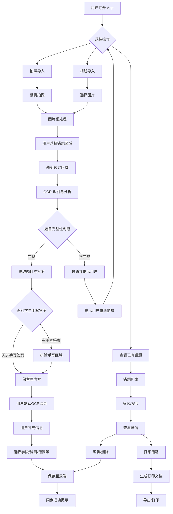
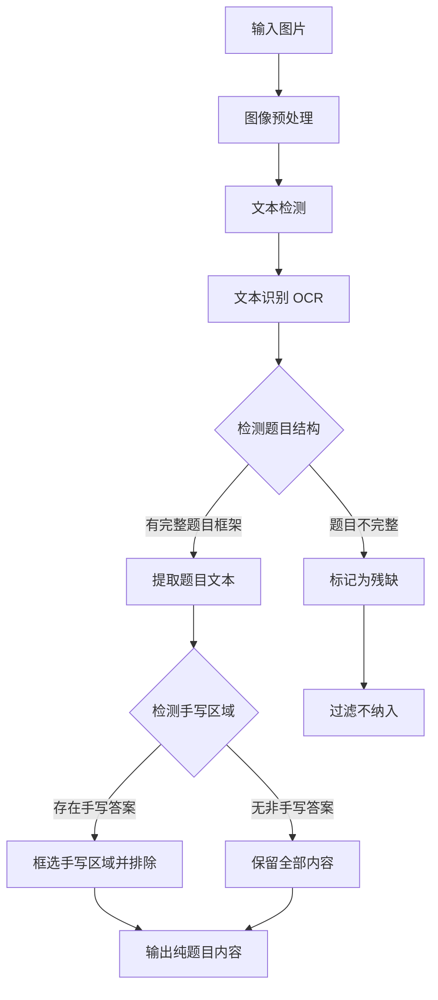
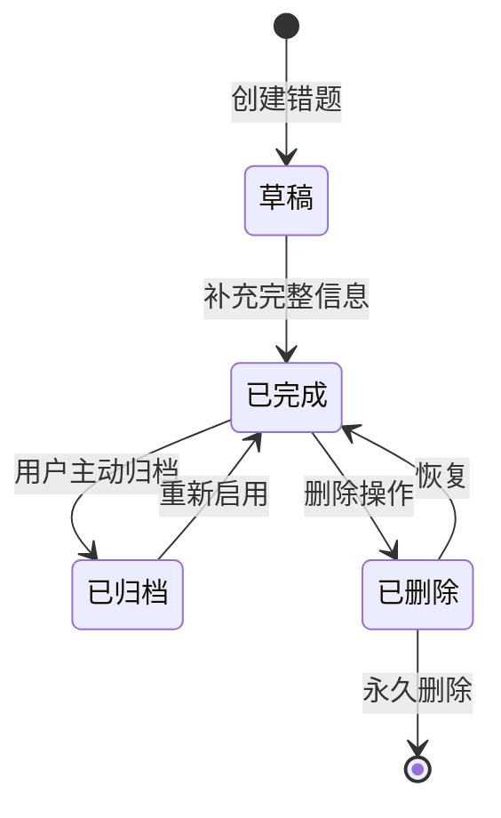
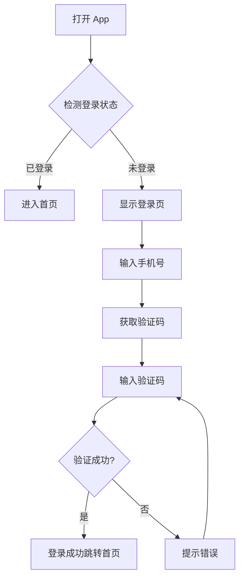
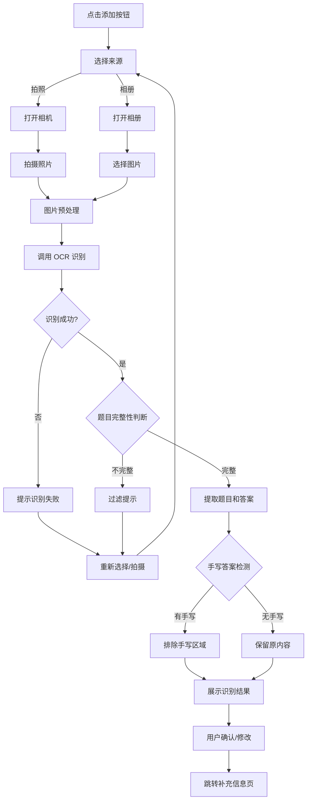
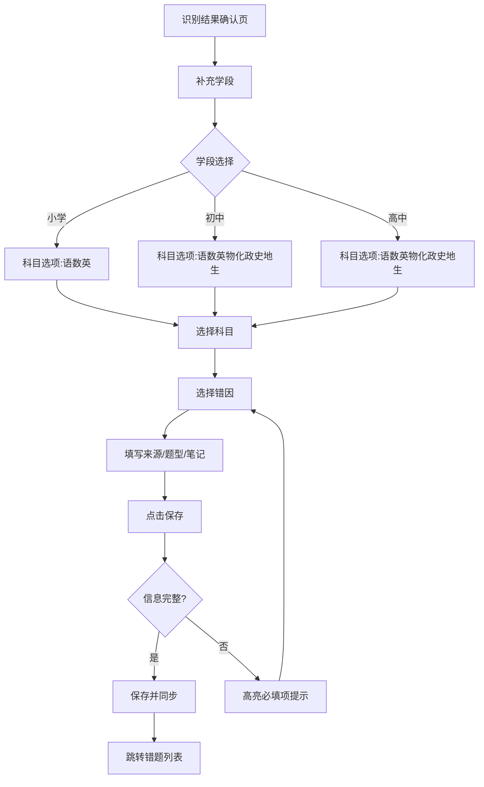
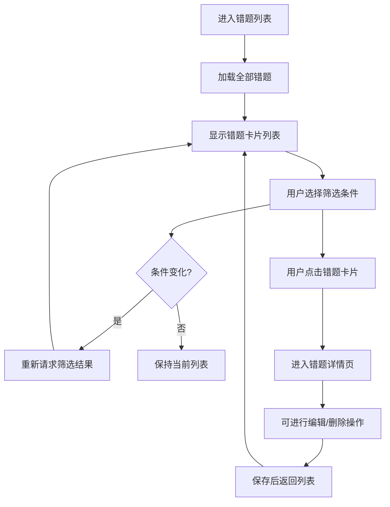
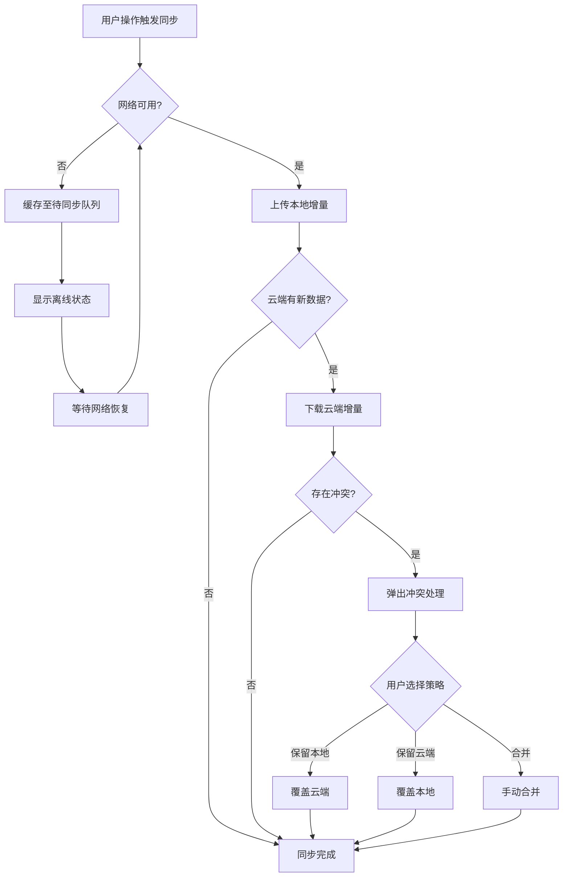

# 状元错题集 产品需求文档（PRD）

版本号：V1.0.2

| 版本 | 时间 | 修订人 | 备注 |
|------|------|--------|------|
| V1.0.0 | 2026/06/13 | PM | 初始版本，基于需求描述生成 |
| V1.0.1 | 2026/06/13 | PM | 根据反馈调整：明确阿里云OCR/OSS方案、移除家长端、V1.0增加筛选导出打印功能 |
| V1.0.2 | 2026/06/20 | PM | 新增错题区域选择（裁剪）功能；明确使用 recognizeEduQuestionOcrWithOptions 接口，PNG格式不压缩 |

---

## 一、概述

### 1.1 产品概述及目标

#### 1.1.1 背景介绍

在学生日常学习中，错题整理是提升学习效果的关键环节。传统纸质错题本存在以下痛点：

- **整理效率低**：手动抄写题目耗时费力，学生抵触情绪大
- **难以检索**：纸质错题本无法快速按科目、学段、错因等维度筛选
- **无法跨设备同步**：纸质或单机错题本无法在多设备间同步共享
- **打印不便**：学生需要将错题重新排版才能打印，流程繁琐

随着智能手机的普及和 OCR 文字识别技术的成熟，通过拍照导入、自动识别、雲端管理的方式整理错题，能够大幅提升学生整理错题的效率，降低抵触心理，实现个性化学习。

#### 1.1.2 产品概述

状元错题集是一款面向中国 K12 学生的**智能错题整理与学习管理工具**，支持拍照/相册导入错题、AI 自动识别题目与答案、学段/科目/错因等多维筛选、云端同步管理、以及一键打印输出。

#### 1.1.3 产品目标

**业务目标：**

| 目标 | 指标 | 目标值 | 达成时间 |
|------|------|--------|---------|
| 用户增长 | 注册用户数 | 上线后 6 个月达到 50 万 | 上线后 6 个月 |
| 活跃留存 | 日活跃用户（DAU） | 达到注册用户的 30% | 上线后 3 个月 |
| 付费转化 | 付费用户占比 | 达到 5% | 上线后 6 个月 |

**用户目标：**

| 目标用户 | 用户目标 | 衡量指标 |
|---------|---------|---------|
| 学生（小学/初中/高中） | 快速整理错题，节省抄写时间 | 单题整理时间 < 30 秒 |
| 学生 | 按科目/错因等维度检索错题 | 检索到目标错题 < 3 步 |
| 学生 | 多设备无缝访问自己的错题集 | 跨设备同步成功率 > 99% |
| 学生 | 打印错题用于练习或请教老师 | 打印成功率 > 98% |
| 学生 | 自定义标签管理错题，便于个性化分类 | 支持多标签自由组合 |

#### 1.1.4 目标用户

| 角色 | 描述 | 核心诉求 |
|------|------|---------|
| 小学生 | 6-12 岁，需要家长辅助操作 | 简单易用，界面友好 |
| 初中生 | 12-15 岁，独立操作能力较强 | 高效整理，快速检索 |
| 高中生 | 15-18 岁，时间紧张，追求效率 | 功能全面，支持打印 |

---

### 1.2 名词说明

| 名词 | 说明 |
|------|------|
| OCR | Optical Character Recognition，光学字符识别，指对图像中的文字进行检测和识别 |
| 错题 | 学生做错的题目，包含题目正文、答案、解析、错因等要素 |
| 学段 | 区分小学、初中、高中三个教育阶段 |
| 科目 | 学科分类，如语文、数学、英语、物理、化学等 |
| 错因 | 错误原因分类，如审题不清、计算错误、概念模糊、知识点遗漏等 |
| 来源 | 错题出处，如某次考试、练习册、试卷名称等 |
| 题型 | 题目类型，如选择题、填空题、解答题、证明题等 |
| 云端同步 | 数据在多个设备间通过网络实时保持一致 |

---

### 1.3 角色及权限

| 角色 | 权限范围 | 数据范围 |
|------|---------|---------|
| 游客用户 | 浏览应用介绍和帮助页 | 无 |
| 注册用户（学生） | 导入/编辑/删除自己的错题、筛选、导出/打印、云端同步、标签管理 | 仅本人数据 |
| 管理员 | 系统配置、用户管理、内容审核 | 全部数据 |

---

### 1.4 文档阅读对象

| 对象 | 关注内容 |
|------|---------|
| 研发 | 功能需求、接口设计、数据字典、OCR 集成方案 |
| UI/UX | 界面交互、页面流程、打印排版规范 |
| 测试 | 异常流程、验收标准、OCR 识别准确率测试要点 |
| 运营 | 用户增长策略、埋点方案、数据分析需求 |

---

## 二、产品描述

### 2.1 产品需求描述

状元错题集旨在为 K12 学生提供一套完整的"拍照→识别→整理→复习→打印"错题管理闭环，具体包含以下范围：

**做：**
- 支持拍照和相册导入错题图片
- **支持用户选定错题区域（裁剪选择）**，只对选定区域进行 OCR 识别
- AI 自动识别图片中的题目区域，过滤不完整题目
- AI 自动区分题目正文与学生手写答案（答案区域排除）
- 支持按学段（小学/初中/高中）、科目、错因、来源、题型、错误时间等多维度管理错题
- 错题数据云端存储，支持多设备同步
- 支持筛选后错题导出为 Word/PDF 文档（V1.0），题目间保留充足空白便于学生重新作答
- 支持错题自定义标签管理（如"易错"、"难题"、"待复习"等）
- 错题复习提醒与学习统计

**不做：**
- 不提供在线答题和自动批改功能
- 不提供老师端布置作业功能（作为独立模块延后规划）
- 不支持视频、音频等非图片类错题录入
- 不提供家长端功能（查看孩子错题统计等）

---

### 2.2 产品整体流程

#### 2.2.1 主流程



#### 2.2.2 错题识别子流程



#### 2.2.3 状态转换图



---

### 2.3 全局说明

#### 2.3.1 全局异常处理

| 异常场景 | 处理方式 | 提示文案 |
|---------|---------|---------|
| 网络异常 | 显示提示，支持重试 | "网络连接失败，请检查网络后重试" |
| 服务超时 | 显示提示，支持重试 | "服务响应超时，请稍后重试" |
| 权限异常 | 引导用户开启权限 | "需要相机/存储权限，请前往设置开启" |
| OCR 识别失败 | 提示用户手动输入或重新拍摄 | "无法识别图片中的文字，请重新拍摄或手动输入" |
| 题目不完整 | 过滤并提示 | "检测到题目不完整，已自动过滤，请重新拍摄完整题目" |
| 云端同步失败 | 本地缓存，延迟同步 | "同步失败，已保存至本地，网络恢复后自动同步" |
| 存储空间不足 | 提示清理 | "存储空间不足，请清理后重试" |

#### 2.3.2 普通列表规则

| 规则项 | 说明 |
|--------|------|
| 分页 | 默认 20 条/页，可调整为 10/50/100 |
| 排序 | 默认按错误时间倒序，支持按科目、题型、错因排序 |
| 筛选 | 支持学段+科目+错因+来源+题型+时间范围 多条件组合筛选 |
| 搜索 | 支持题目内容关键词模糊搜索 |
| 空数据 | 显示插画 + "还没有错题，拍照添加第一道吧" |
| 统计 | 列表顶部展示错题总数、各科目分布 |
| 批量操作 | 支持批量删除、批量归档，需二次确认 |

#### 2.3.3 全局交互

| 场景 | 交互方式 |
|------|---------|
| 操作成功 | Toast 提示"保存成功"，自动消失 |
| 操作失败 | 弹窗提示错误详情 |
| 加载中 | 显示全局 loading 动画或骨架屏 |
| 表单保存 | 自动返回上一页并提示 |
| 删除操作 | 二次确认弹窗 "确定要删除这道错题吗？" |
| 异步操作 | 按钮置灰防止重复提交 |
| 空状态 | 显示插画 + 文字提示 |
| 权限请求 | 首次使用时弹出系统权限申请框 |

---

### 2.4 产品版本规划

| 版本 | 范围 | 计划时间 | 状态 |
|------|------|---------|------|
| V1.0 | 核心功能 MVP（拍照导入、阿里云 OCR、学段/科目管理、标签管理、多维筛选、云端同步、筛选后导出 Word/PDF） | 2026/Q3 | 规划中 |
| V1.1 | 端侧 OCR 识别（高通/MTK/iPhone 平台）、打印功能（Android Print Framework） | 2026/Q4 | 规划中 |
| V1.2 | 错题内容编辑修改、错题分享功能 | 2027/Q1 | 远期 |
| V2.0 | 错题复习提醒、学习统计分析 | 2027/Q2 | 远期 |

---

### 2.5 产品框架

```
┌─────────────────────────────────────────────────────────────┐
│                        APP 层                                │
│  ┌─────────┐ ┌─────────┐ ┌─────────┐ ┌─────────┐           │
│  │  首页   │ │ 错题列表 │ │ 添加错题 │ │ 我的    │           │
│  │  概览   │ │ 筛选管理 │ │ 拍照导入 │ │ 设置同步│           │
│  └─────────┘ └─────────┘ └─────────┘ └─────────┘           │
└──────────────────────────┬──────────────────────────────────┘
                           │
┌──────────────────────────▼──────────────────────────────────┐
│                      业务逻辑层                               │
│  ┌──────────┐ ┌──────────┐ ┌──────────┐ ┌──────────┐      │
│  │ OCR识别服务│ │ 错题管理  │ │ 同步服务  │ │ 打印服务  │      │
│  │ 图片预处理 │ │ 标签管理  │ │ 冲突处理  │ │ 文档生成  │      │
│  │ 端侧OCR   │ │ 筛选排序  │ │          │ │          │      │
│  └──────────┘ └──────────┘ └──────────┘ └──────────┘      │
└──────────────────────────┬──────────────────────────────────┘
                           │
┌──────────────────────────▼──────────────────────────────────┐
│                      数据层                                   │
│  ┌──────────┐ ┌──────────┐ ┌──────────┐                    │
│  │ 本地数据库│ │ 云端数据库│ │ 文件存储  │                    │
│  │ SQLite   │ │ MySQL    │ │ 阿里云OSS │                    │
│  └──────────┘ └──────────┘ └──────────┘                    │
└──────────────────────────┬──────────────────────────────────┘
                           │
┌──────────────────────────▼──────────────────────────────────┐
│                      第三方服务                               │
│  ┌──────────┐ ┌──────────┐ ┌──────────┐                    │
│  │ 阿里云OCR │ │ 云端API   │ │ Android  │                    │
│  │ (V1.0)   │ │          │ │ Print FW │                    │
│  │ 端侧OCR  │ │          │ │ (V1.1)   │                    │
│  │ (V1.1)   │ │          │ │          │                    │
│  └──────────┘ └──────────┘ └──────────┘                    │
└─────────────────────────────────────────────────────────────┘
```

---

### 2.6 功能清单

| 模块 | 功能 | 优先级 | 版本 | 说明 |
|------|------|--------|------|------|
| 登录注册 | 手机号+验证码登录 | P0 | V1.0 | 云端同步必需 |
| 错题导入 | 相机拍照导入 | P0 | V1.0 | 核心流程 |
| 错题导入 | 相册选择图片导入 | P0 | V1.0 | 核心流程 |
| 错题导入 | 错题区域选择（裁剪） | P0 | V1.0 | 用户拖动选择框选定错题区域，只对该区域OCR |
| 错题识别 | 阿里云 OCR 题目识别（云端） | P0 | V1.0 | 调用阿里云 recognizeEduQuestionOcrWithOptions 接口，PNG格式不压缩 |
| 错题识别 | 端侧 OCR 识别（高通/MTK/iPhone） | P0 | V1.1 | 本地离线识别 |
| 错题识别 | 完整性判断过滤 | P0 | V1.0 | 过滤残缺题目 |
| 错题识别 | 手写答案区域排除 | P1 | V1.0 | AI 识别排除 |
| 错题管理 | 错题增删改查 | P0 | V1.0 | 基础 CRUD |
| 错题管理 | 学段/科目/错因标记 | P0 | V1.0 | 核心分类维度 |
| 错题管理 | 来源/题型/时间标记 | P1 | V1.0 | 扩展维度 |
| 错题管理 | 自定义标签管理 | P1 | V1.0 | 支持多标签组合 |
| 错题管理 | 多维筛选 | P0 | V1.0 | 核心功能 |
| 错题管理 | 关键词搜索 | P0 | V1.0 | 全局搜索 |
| 错题管理 | 批量操作 | P1 | V1.0 | 批量删除/归档 |
| 错题管理 | 错题内容编辑修改 | P1 | V1.2 | 修改已识别题目内容 |
| 错题管理 | 错题分享 | P1 | V1.2 | 分享给同学/老师 |
| 云端同步 | 数据云端存储（阿里云 OSS） | P0 | V1.0 | 核心需求 |
| 云端同步 | 多设备实时同步 | P0 | V1.0 | 核心需求 |
| 云端同步 | 离线支持与冲突处理 | P1 | V1.0 | 弱网体验 |
| 打印/导出 | 筛选后导出 Word/PDF | P1 | V1.0 | 题目间留白便于重做 |
| 打印 | Android Print Framework 打印 | P1 | V1.1 | 调用系统打印服务 |
| 统计 | 错题分布统计 | P2 | V2.0 | 各维度分布 |
| 设置 | 账号与安全 | P0 | V1.0 | 基础设置 |
| 设置 | 同步管理 | P0 | V1.0 | 手动触发同步 |

---

## 三、功能需求

### 3.1 用户注册登录

#### 3.1.1 描述
支持用户通过手机号验证码快速注册登录，建立个人云端账户体系。

#### 3.1.2 用户故事
```
作为学生，我希望通过手机号快速登录，以便我的错题数据能够云端保存和多设备同步。
```

#### 3.1.3 前置条件

| 类型 | 条件 |
|------|------|
| 网络依赖 | 需要网络连接完成验证码发送和登录 |
| 权限依赖 | 需要获取手机号（通过短信读取权限或用户手动输入） |

#### 3.1.4 后置条件
- 用户登录成功后初始化本地数据库与云端同步
- 未登录用户仅可浏览帮助页和示例错题集

#### 3.1.5 界面及交互

| 元素 | 类型 | 必填 | 默认值 | 校验规则 | 操作反馈 |
|------|------|------|--------|---------|---------|
| 手机号 | 文本输入框 | 是 | - | 11位数字，以1开头 | 格式错误提示"请输入正确的手机号" |
| 验证码 | 文本输入框 | 是 | - | 6位数字 | 倒计时60秒后可重新获取 |

#### 3.1.6 业务流程



#### 3.1.7 异常/分支流程

| 场景 | 触发条件 | 处理方式 | 提示文案 |
|------|---------|---------|---------|
| 验证码发送失败 | 网络问题或接口异常 | 显示重试按钮 | "验证码发送失败，请稍后重试" |
| 验证码错误 | 用户输入错误验证码 | 提示剩余尝试次数 | "验证码错误，还能重试2次" |
| 验证码过期 | 超过5分钟 | 提示重新获取 | "验证码已过期，请重新获取" |

#### 3.1.8 数据字典

| 字段名 | 类型 | 必填 | 说明 | 示例值 |
|--------|------|------|------|--------|
| id | Long | 是 | 主键 | 100001 |
| phone | String(11) | 是 | 手机号 | "13800138000" |
| nickname | String(50) | 否 | 昵称 | "小明" |
| avatar_url | String(255) | 否 | 头像URL | "https://..." |
| created_at | DateTime | 是 | 注册时间 | 2026-06-13 10:00:00 |
| updated_at | DateTime | 是 | 更新时间 | 2026-06-13 10:00:00 |

---

### 3.2 错题拍照导入

#### 3.2.1 描述
用户通过相机拍摄或相册选择包含错题的图片，系统自动进行 OCR 识别和预处理。

#### 3.2.2 用户故事
```
作为学生，我希望拍照就能自动识别题目，省去手动输入的麻烦。
作为学生，我希望系统能自动过滤掉不完整的题目，避免无效整理。
作为学生，我希望系统能过滤掉我写的答案，只保留原题。
```

#### 3.2.3 前置条件

| 类型 | 条件 |
|------|------|
| 权限依赖 | 需要相机权限（拍照时） |
| 权限依赖 | 需要相册读取权限（选图时） |
| 网络依赖 | 需要网络进行 OCR 识别 |

#### 3.2.4 后置条件
- 识别成功后跳转至错题信息补充页
- 原始图片和识别结果保存至本地和云端

#### 3.2.5 界面及交互

| 元素 | 类型 | 必填 | 默认值 | 校验规则 | 操作反馈 |
|------|------|------|--------|---------|---------|
| 相机预览 | 相机画面 | - | - | - | - |
| 拍摄按钮 | 圆形按钮 | - | - | 单次点击 | 拍照后显示缩略图预览 |
| 相册入口 | 图标按钮 | - | - | - | 打开系统相册 |
| 网格线 | 辅助线 | - | 开启 | 可开关 | 帮助用户对齐题目 |
| 闪光灯 | 图标按钮 | - | 关闭 | - | 切换闪光灯开关 |
| 拍摄结果 | 缩略图 | - | - | - | 点击可重新拍摄 |

#### 3.2.6 业务流程



#### 3.2.7 异常/分支流程

| 场景 | 触发条件 | 处理方式 | 提示文案 |
|------|---------|---------|---------|
| 相机权限拒绝 | 用户拒绝相机权限 | 引导去设置开启 | "需要相机权限才能拍照，请在设置中开启" |
| 相册权限拒绝 | 用户拒绝存储权限 | 引导去设置开启 | "需要存储权限才能选择图片，请在设置中开启" |
| OCR 识别失败 | 图片文字无法识别 | 提示手动输入 | "无法识别图片内容，请尝试重新拍摄或手动输入" |
| 题目不完整 | 检测到题目区域不完整 | 过滤并提示 | "检测到题目不完整，已自动过滤" |
| 网络不可用 | 离线状态 | 缓存本地，等网络恢复后识别 | "网络不可用，图片已缓存，网络恢复后自动识别" |

#### 3.2.8 OCR 识别规范

| 项目 | 规范 |
|------|------|
| 识别 API | 阿里云 `recognizeEduQuestionOcrWithOptions` 接口 |
| 图片格式 | PNG（不压缩），保证识别准确率 |
| 识别语言 | 中文简体、英文、数学公式 |
| 题目完整性判断 | 题目需包含题号（如"1."、"第1题"）和完整句子 |
| 手写排除 | 区分印刷体与手写体，排除手写答案区域 |
| 数学公式 | 支持根号、分数、上下标等常见数学符号识别 |

#### 3.2.9 数据字典

| 字段名 | 类型 | 必填 | 说明 | 示例值 |
|--------|------|------|------|--------|
| id | Long | 是 | 主键 | 200001 |
| user_id | Long | 是 | 用户ID，外键 | 100001 |
| original_image_url | String(255) | 是 | 原始图片云端URL | "https://..." |
| original_image_local | String(255) | 是 | 原始图片本地路径 | "/storage/..." |
| recognized_text | Text | 是 | OCR识别文本 | "题目：xxx\n答案：xxx" |
| is_complete | Boolean | 是 | 题目是否完整 | true |
| has_handwriting | Boolean | 是 | 是否含手写内容 | true |
| handwriting_regions | JSON | 否 | 手写区域坐标数组 | [{"x":10,"y":20,...}] |
| ocr_confidence | Float | 是 | OCR识别置信度 | 0.95 |
| created_at | DateTime | 是 | 创建时间 | 2026-06-13 10:00:00 |

---

### 3.3 错题信息管理

#### 3.3.1 描述
用户对识别后的错题进行学段、科目、错因、来源、题型等信息标注和补充。

#### 3.3.2 用户故事
```
作为学生，我希望为每道错题标记科目和错因，以便后续按这些维度筛选复习。
作为学生，我希望记录错题来源（哪次考试），方便定位出处。
```

#### 3.3.3 前置条件

| 类型 | 条件 |
|------|------|
| 数据依赖 | 需要先完成 OCR 识别并确认题目内容 |
| 功能依赖 | 需要先完成登录 |

#### 3.3.4 后置条件
- 错题保存至本地数据库并同步至云端
- 列表页实时更新

#### 3.3.5 界面及交互

| 元素 | 类型 | 必填 | 默认值 | 校验规则 | 操作反馈 |
|------|------|------|--------|---------|---------|
| 学段 | 单选下拉 | 是 | 未选择 | 必选 | 小学/初中/高中 |
| 科目 | 单选下拉 | 是 | 未选择 | 必选 | 根据学段联动显示对应科目 |
| 错因 | 多选/单选 | 是 | 未选择 | 必选 | 审题不清/计算错误/概念模糊/知识点遗漏/粗心大意/其他 |
| 来源 | 文本输入 | 否 | 空 | 0-100字符 | 如"期中考试数学卷" |
| 题型 | 单选下拉 | 否 | 未选择 | - | 选择题/填空题/解答题/证明题/其他 |
| 错误时间 | 日期选择 | 是 | 今天 | 不可选未来日期 | - |
| 正确答案 | 多行文本 | 否 | 空 | - | 用户自行填写正确答案 |
| 我的错误答案 | 多行文本 | 否 | 空 | - | 用户自行填写错误答案 |
| 解析/笔记 | 多行文本 | 否 | 空 | 0-500字符 | 用户补充解题思路 |
| 自定义标签 | 多选标签 | 否 | 空 | 最多10个标签 | 支持"易错"、"难题"、"待复习"等自定义标签 |

**科目联动规则：**

| 学段 | 支持科目 |
|------|---------|
| 小学 | 语文、数学、英语 |
| 初中 | 语文、数学、英语、物理、化学、政治、历史、地理、生物 |
| 高中 | 语文、数学、英语、物理、化学、政治、历史、地理、生物 |

#### 3.3.6 业务流程



#### 3.3.7 异常/分支流程

| 场景 | 触发条件 | 处理方式 | 提示文案 |
|------|---------|---------|---------|
| 学段未选 | 直接点击保存 | 高亮提示 | "请选择学段" |
| 科目未选 | 直接点击保存 | 高亮提示 | "请选择科目" |
| 错因未选 | 直接点击保存 | 高亮提示 | "请选择错因" |
| 必填项缺失 | 保存时检测 | 禁止提交 | - |
| 文本超长 | 输入超过限制 | 截断并提示 | "内容不能超过500字符" |

#### 3.3.8 数据字典

| 字段名 | 类型 | 必填 | 说明 | 示例值 |
|--------|------|------|------|--------|
| id | Long | 是 | 主键 | 300001 |
| user_id | Long | 是 | 用户ID，外键 | 100001 |
| original_image_id | Long | 是 | 关联原始图片ID | 200001 |
| subject_stage | Enum | 是 | 学段：PRIMARY/MIDDLE/HIGH | "MIDDLE" |
| subject | String(20) | 是 | 科目 | "数学" |
| error_reason | Enum | 是 | 错因 | "CONCEPT_UNCLEAR" |
| source | String(100) | 否 | 来源 | "期中考试" |
| question_type | Enum | 否 | 题型 | "SOLUTION" |
| error_date | Date | 是 | 错误时间 | 2026-06-13 |
| correct_answer | Text | 否 | 正确答案 | "x=3" |
| wrong_answer | Text | 否 | 错误答案 | "x=5" |
| notes | Text | 否 | 解析/笔记 | "应先移项再计算" |
| tags | JSON Array | 否 | 自定义标签列表 | ["易错","难题"] |
| status | Enum | 是 | 状态：ACTIVE/ARCHIVED/DELETED | "ACTIVE" |
| created_at | DateTime | 是 | 创建时间 | 2026-06-13 10:00:00 |
| updated_at | DateTime | 是 | 更新时间 | 2026-06-13 10:00:00 |

**错因枚举值：**

| 枚举值 | 说明 |
|--------|------|
| MISREAD | 审题不清 |
| CALC_ERROR | 计算错误 |
| CONCEPT_UNCLEAR | 概念模糊 |
| KNOWLEDGE_GAP | 知识点遗漏 |
| CARELESS | 粗心大意 |
| OTHER | 其他 |

**题型枚举值：**

| 枚举值 | 说明 |
|--------|------|
| CHOICE | 选择题 |
| FILL_BLANK | 填空题 |
| SOLUTION | 解答题 |
| PROOF | 证明题 |
| OTHER | 其他 |

---

### 3.4 错题列表与筛选

#### 3.4.1 描述
展示用户错题列表，支持按学段、科目、错因、来源、题型、时间等多维度筛选和关键词搜索。

#### 3.4.2 用户故事
```
作为学生，我希望按科目查看我的错题，快速找到需要复习的内容。
作为学生，我希望按错因筛选，了解自己哪类错误最多。
作为学生，我希望按时间筛选，查看某次考试后的错题。
```

#### 3.4.3 前置条件

| 类型 | 条件 |
|------|------|
| 数据依赖 | 用户至少有一条错题 |
| 功能依赖 | 需要先完成登录 |

#### 3.4.4 后置条件
- 筛选条件变化时，列表实时刷新
- 筛选状态可保存，退出页面后恢复

#### 3.4.5 界面及交互

| 元素 | 类型 | 必填 | 默认值 | 校验规则 | 操作反馈 |
|------|------|------|--------|---------|---------|
| 错题卡片 | 列表项 | - | - | - | 点击进入详情 |
| 学段筛选 | 标签选择 | 否 | 全部 | - | 单选/全部 |
| 科目筛选 | 标签选择 | 否 | 全部 | - | 单选/全部 |
| 错因筛选 | 标签选择 | 否 | 全部 | - | 多选/全部 |
| 自定义标签筛选 | 标签选择 | 否 | 全部 | - | 多选/全部，支持"易错"/"难题"等 |
| 时间范围 | 日期区间 | 否 | 全部 | 开始≤结束 | - |
| 来源搜索 | 文本输入 | 否 | 空 | - | 支持模糊匹配 |
| 题型筛选 | 标签选择 | 否 | 全部 | - | 单选/全部 |
| 关键词搜索 | 搜索框 | 否 | 空 | - | 搜索题目内容 |
| 排序 | 下拉选择 | 否 | 按时间倒序 | - | 时间/科目/创建时间 |
| 批量选择 | 复选框 | - | 关闭 | - | 长按或编辑模式开启 |
| 统计摘要 | 顶部标签栏 | - | - | - | 显示当前筛选结果数量 |

#### 3.4.6 业务流程



#### 3.4.7 异常/分支流程

| 场景 | 触发条件 | 处理方式 | 提示文案 |
|------|---------|---------|---------|
| 列表为空 | 筛选结果为空 | 显示空状态插画 | "没有符合条件的错题" |
| 网络异常 | 列表加载失败 | 显示错误页，支持重试 | "加载失败，请检查网络后重试" |
| 关键词无结果 | 搜索无匹配 | 显示搜索无结果提示 | "未找到包含该关键词的错题" |
| 批量删除 | 用户确认删除 | 执行批量删除 | "已删除X道错题" |

#### 3.4.8 数据字典

**筛选条件缓存：**

| 字段名 | 类型 | 说明 | 示例值 |
|--------|------|------|--------|
| filter_stage | String | 学段筛选 | "MIDDLE" |
| filter_subject | String | 科目筛选 | "数学" |
| filter_reasons | JSON Array | 错因筛选 | ["CONCEPT_UNCLEAR","CALC_ERROR"] |
| filter_date_start | Date | 开始时间 | 2026-01-01 |
| filter_date_end | Date | 结束时间 | 2026-06-13 |
| filter_source | String | 来源关键词 | "期中" |
| filter_type | String | 题型筛选 | "SOLUTION" |
| keyword | String | 搜索关键词 | "方程" |
| sort_by | String | 排序字段 | "error_date" |
| sort_order | String | 排序方向 | "DESC" |

---

### 3.5 云端同步

#### 3.5.1 描述
用户错题数据在本地与云端实时同步，支持多设备访问同一账户数据，并处理离线场景和同步冲突。

#### 3.5.2 用户故事
```
作为学生，我希望在手机上整理的错题，在平板上也能看到。
作为学生，我希望在离线时也能使用，关机后自动同步。
```

#### 3.5.3 前置条件

| 类型 | 条件 |
|------|------|
| 账号依赖 | 用户已登录账号 |
| 网络依赖 | 建议网络连接（非强制） |

#### 3.5.4 后置条件
- 同步完成后，本地数据与云端保持一致
- 同步记录写入日志

#### 3.5.5 界面及交互

| 元素 | 类型 | 必填 | 默认值 | 校验规则 | 操作反馈 |
|------|------|------|--------|---------|---------|
| 同步状态 | 图标 | - | - | - | 上传中/同步成功/同步失败/离线 |
| 最后同步时间 | 文本 | - | - | - | 显示具体时间 |
| 手动同步 | 按钮 | - | - | - | 下拉刷新或点击同步图标 |
| 冲突提示 | 弹窗 | - | - | - | 显示冲突项及处理方式 |
| 离线指示 | Banner | - | - | - | 提示当前处于离线模式 |

#### 3.5.6 业务流程



#### 3.5.7 异常/分支流程

| 场景 | 触发条件 | 处理方式 | 提示文案 |
|------|---------|---------|---------|
| 同步失败 | 网络或服务端异常 | 自动重试3次，失败则提示 | "同步失败，将自动重试" |
| 冲突 | 同一条数据两端都有修改 | 弹窗让用户选择 | "检测到数据冲突，请选择保留哪个版本" |
| 存储空间不足 | 云端配额用完 | 提示清理或升级 | "云端存储空间不足，请联系客服" |
| 账号异常 | token失效或账号被封 | 跳转重新登录 | "登录状态已失效，请重新登录" |

#### 3.5.8 冲突处理策略

| 冲突类型 | 默认策略 | 用户可选 |
|---------|---------|---------|
| 题目内容冲突 | 保留最新修改 | 可选择任意版本 |
| 标签冲突 | 合并去重 | - |
| 删除冲突 | 以删除为准 | - |

---

### 3.6 错题导出与打印

#### 3.6.1 描述
用户可以从筛选后的错题列表中选择错题，导出为 Word/PDF 文档，留出足够空白区域便于学生重新作答。V1.1 版本额外支持通过 Android Print Framework 直接调用系统打印服务。

#### 3.6.2 用户故事
```
作为学生，我希望筛选后导出错题到 Word/PDF，打印出来重新做一遍。
作为学生，我希望题目之间留够空白，方便我重新作答后再对答案。
作为学生，我希望直接调用系统打印服务，无需第三方打印工具。
```

#### 3.6.3 前置条件

| 类型 | 条件 |
|------|------|
| 数据依赖 | 至少有一条错题 |
| 功能依赖 | 需要选择要打印的错题 |

#### 3.6.4 后置条件
- 生成打印文档或打开系统打印对话框

#### 3.6.5 界面及交互

| 元素 | 类型 | 必填 | 默认值 | 校验规则 | 操作反馈 |
|------|------|------|--------|---------|---------|
| 打印预览 | 页面预览 | - | - | - | 缩略图展示排版效果 |
| 选择错题 | 复选列表 | 是 | - | 至少选1条 | 显示已选数量 |
| 打印份数 | 数字输入 | 是 | 1 | 1-10份 | - |
| 包含内容 | 多选 | 是 | 题目+答案 | - | 可选：题目/答案/解析/笔记/来源 |
| 答案放置 | 单选 | 是 | 另起一页 | - | 另起一页/穿插在题后 |
| 纸张方向 | 单选 | 是 | 纵向 | - | 纵向/横向 |
| 题目间留白 | 滑动条 | 否 | 大（留白多） | 小/中/大 | 控制题间空白，便于重做作答 |
| 字体大小 | 滑动条 | 否 | 中等 | 小/中/大 | 影响打印清晰度 |
| 预览按钮 | 按钮 | - | - | - | 打开详细预览页 |
| 导出按钮 | 按钮 | - | - | - | 导出 Word/PDF（V1.0） |
| 直接打印 | 按钮 | - | - | - | 调用 Android Print FW（V1.1） |

#### 3.6.6 打印排版规范

> V1.0 导出 Word/PDF 时，题目间保留充足空白（至少 5cm），便于学生重新作答。

```
┌────────────────────────────────────────┐
│  状元错题集 - 导出日期: 2026/06/13      │
│  学生: 小明  科目: 数学  共 X 道错题     │
├────────────────────────────────────────┤
│                                        │
│  【题目 1】                            │
│  1. 计算: 2x + 5 = 15, 求x的值。        │
│                                        │
│  ┄┄┄┄┄┄┄┄┄┄┄┄┄┄┄┄┄┄┄┄┄┄┄┄┄┄┄┄┄┄┄   │  ← 空白区域（≥5cm）
│  ┄┄┄┄┄┄┄┄┄┄┄┄┄┄┄┄┄┄┄┄┄┄┄┄┄┄┄┄┄┄┄   │
│                                        │
│  【答案】（另起一页或背面）              │
│  x = 5                                 │
│                                        │
│  【错因】计算错误                       │
│  【来源】期中考试数学卷                  │
├────────────────────────────────────────┤
│  【题目 2】                            │
│  ...                                   │
│                                        │
│  ┄┄┄┄┄┄┄┄┄┄┄┄┄┄┄┄┄┄┄┄┄┄┄┄┄┄┄┄┄┄┄   │  ← 空白区域（≥5cm）
│  ┄┄┄┄┄┄┄┄┄┄┄┄┄┄┄┄┄┄┄┄┄┄┄┄┄┄┄┄┄┄┄   │
└────────────────────────────────────────┘
```

> V1.1 Android Print Framework 打印走系统打印对话框，支持任意支持 Mopria 的打印机，无需特殊适配。

#### 3.6.7 异常/分支流程

| 场景 | 触发条件 | 处理方式 | 提示文案 |
|------|---------|---------|---------|
| 未选择错题 | 点击打印但未选择 | 高亮提示 | "请先选择要导出的错题" |
| 导出失败 | 文件写入异常 | 提示重试 | "导出失败，请稍后重试" |
| 错题数量超限 | 单次导出超过50条 | 提示分批导出 | "单次最多导出50道错题" |
| 直接打印（V1.1）| 设备无打印服务 | 提示导出文件 | "当前设备不支持打印，请导出后打印" |

#### 3.6.8 数据字典

| 字段名 | 类型 | 必填 | 说明 | 示例值 |
|--------|------|------|------|--------|
| id | Long | 是 | 主键 | 400001 |
| user_id | Long | 是 | 用户ID | 100001 |
| print_task_name | String(100) | 是 | 打印任务名称 | "数学错题打印_20260613" |
| question_ids | JSON Array | 是 | 错题ID列表 | [300001,300002] |
| print_config | JSON | 是 | 打印配置 | {"orientation":"portrait",...} |
| file_url | String(255) | 否 | 导出文件URL | "https://..." |
| status | Enum | 是 | 状态 | "PENDING" |
| created_at | DateTime | 是 | 创建时间 | 2026-06-13 10:00:00 |

---

## 四、非功能需求

### 4.1 安全与合规需求

| 需求 | 说明 |
|------|------|
| 数据加密 | 敏感字段（手机号）加密存储，传输使用 HTTPS |
| 身份认证 | JWT Token 认证，支持 token 刷新和主动登出 |
| 权限控制 | 基于 RBAC 模型，用户只能操作自己的数据 |
| 未成年人保护 | 限制未实名用户使用时长，符合国家相关规定 |
| 隐私合规 | 符合《个人信息保护法》、《儿童个人信息网络保护规定》 |

---

### 4.2 统计需求（埋点）

| 事件名 | 触发时机 | 属性 | 说明 |
|--------|---------|------|------|
| page_view | 页面加载完成 | page_name, user_id, session_id | 页面访问统计 |
| button_click | 按钮点击 | button_name, page_name, user_id | 操作行为统计 |
| photo_capture | 拍照完成 | user_id, source(camera/album) | 拍照来源统计 |
| ocr_success | OCR识别成功 | user_id, confidence, has_handwriting | OCR成功率监控 |
| ocr_fail | OCR识别失败 | user_id, fail_reason | OCR失败分析 |
| question_complete | 错题信息完善 | user_id, stage, subject, reason | 错题录入完成统计 |
| filter_use | 筛选操作 | user_id, filter_type, filter_values | 筛选使用统计 |
| print_start | 开始打印/导出 | user_id, question_count, format | 打印功能使用 |
| sync_success | 同步成功 | user_id, sync_type, duration | 同步性能监控 |
| sync_fail | 同步失败 | user_id, fail_reason | 同步失败分析 |
| error_occur | 异常发生 | error_code, error_msg, user_id | 异常监控 |

---

### 4.3 性能需求

| 指标 | 要求 |
|------|------|
| 页面加载时间 | 首屏 < 2s（4G 网络） |
| 拍照到识别完成 | < 5s（含网络请求） |
| OCR 识别准确率 | 印刷体 > 95%，手写体 > 85% |
| 接口响应时间 | P99 < 500ms |
| 列表加载 | 20条数据 < 1s |
| 同步延迟 | 正常网络下 < 30s |
| 离线支持 | 至少支持 7 天离线使用 |
| 并发支持 | 支持 10 万同时在线用户 |

---

### 4.4 数据库设计

**核心表结构：**

```sql
-- 用户表
CREATE TABLE users (
    id BIGINT PRIMARY KEY AUTO_INCREMENT,
    phone VARCHAR(11) UNIQUE,
    nickname VARCHAR(50),
    avatar_url VARCHAR(255),
    created_at DATETIME DEFAULT CURRENT_TIMESTAMP,
    updated_at DATETIME DEFAULT CURRENT_TIMESTAMP ON UPDATE CURRENT_TIMESTAMP
);

-- 错题原始图片表
CREATE TABLE question_images (
    id BIGINT PRIMARY KEY AUTO_INCREMENT,
    user_id BIGINT NOT NULL,
    original_image_url VARCHAR(255),
    original_image_local VARCHAR(255),
    recognized_text TEXT,
    is_complete TINYINT(1) DEFAULT 0,
    has_handwriting TINYINT(1) DEFAULT 0,
    handwriting_regions JSON,
    ocr_confidence FLOAT,
    created_at DATETIME DEFAULT CURRENT_TIMESTAMP,
    FOREIGN KEY (user_id) REFERENCES users(id)
);

-- 错题表
CREATE TABLE questions (
    id BIGINT PRIMARY KEY AUTO_INCREMENT,
    user_id BIGINT NOT NULL,
    image_id BIGINT,
    subject_stage ENUM('PRIMARY','MIDDLE','HIGH') NOT NULL,
    subject VARCHAR(20) NOT NULL,
    error_reason ENUM('MISREAD','CALC_ERROR','CONCEPT_UNCLEAR','KNOWLEDGE_GAP','CARELESS','OTHER') NOT NULL,
    source VARCHAR(100),
    question_type ENUM('CHOICE','FILL_BLANK','SOLUTION','PROOF','OTHER'),
    error_date DATE NOT NULL,
    correct_answer TEXT,
    wrong_answer TEXT,
    notes TEXT,
    tags JSON,
    status ENUM('ACTIVE','ARCHIVED','DELETED') DEFAULT 'ACTIVE',
    created_at DATETIME DEFAULT CURRENT_TIMESTAMP,
    updated_at DATETIME DEFAULT CURRENT_TIMESTAMP ON UPDATE CURRENT_TIMESTAMP,
    FOREIGN KEY (user_id) REFERENCES users(id),
    FOREIGN KEY (image_id) REFERENCES question_images(id)
);

-- 用户自定义标签表
CREATE TABLE user_tags (
    id BIGINT PRIMARY KEY AUTO_INCREMENT,
    user_id BIGINT NOT NULL,
    tag_name VARCHAR(50) NOT NULL,
    tag_color VARCHAR(10),
    created_at DATETIME DEFAULT CURRENT_TIMESTAMP,
    FOREIGN KEY (user_id) REFERENCES users(id),
    UNIQUE KEY uk_user_tag (user_id, tag_name)
);

-- 同步日志表
CREATE TABLE sync_logs (
    id BIGINT PRIMARY KEY AUTO_INCREMENT,
    user_id BIGINT NOT NULL,
    sync_type ENUM('UPLOAD','DOWNLOAD') NOT NULL,
    sync_status ENUM('SUCCESS','FAIL','CONFLICT') NOT NULL,
    detail JSON,
    created_at DATETIME DEFAULT CURRENT_TIMESTAMP,
    FOREIGN KEY (user_id) REFERENCES users(id)
);

-- 索引策略
CREATE INDEX idx_questions_user_stage ON questions(user_id, subject_stage);
CREATE INDEX idx_questions_user_subject ON questions(user_id, subject);
CREATE INDEX idx_questions_user_reason ON questions(user_id, error_reason);
CREATE INDEX idx_questions_error_date ON questions(error_date);
CREATE INDEX idx_questions_status ON questions(status);
```

**数据生命周期管理：**

| 数据类型 | 存储周期 | 清理策略 |
|---------|---------|---------|
| 用户账号 | 永久 | 用户注销后保留6个月 |
| 错题数据 | 永久 | 用户删除后保留30天 |
| 原始图片 | 3年 | 压缩后转移至归档存储 |
| 同步日志 | 1年 | 自动归档后清理 |
| 埋点数据 | 6个月 | 聚合后脱敏保存 |

---

### 4.5 系统集成

| 对接系统 | 接口方向 | 协议 | 说明 |
|---------|---------|------|------|
| 阿里云 OCR | 调用 | HTTP REST | V1.0 云端 OCR 识别 |
| 阿里云 OSS | 调用 | SDK | V1.0 云端文件存储 |
| 端侧 OCR | 本地调用 | NDK/JNI | V1.1 高通/MTK/iPhone 平台 |
| 短信服务 | 调用 | HTTP REST | 验证码发送服务 |
| Android Print FW | 调用 | 系统API | V1.1 系统打印框架 |

---

## 五、附录

### 5.1 验收标准与测试要点

| 功能 | 验收条件 | 优先级 | 测试要点 |
|------|---------|--------|---------|---------|
| 手机号登录 | 输入正确手机号和验证码后成功登录并跳转首页 | P0 | 验证码有效期、错误次数限制 |
| 拍照导入 | 拍摄包含完整题目的图片后成功识别 | P0 | 光线充足/逆光/模糊场景 |
| 相册导入 | 选择图片后成功识别 | P0 | 大图片压缩、格式兼容 |
| 阿里云 OCR | 云端印刷体识别准确率>95% | P0 | 对比原始图片与识别结果 |
| 端侧 OCR（V1.1）| 高通/MTK/iPhone 平台本地识别 | P0 | 离线场景识别率>90% |
| 题目过滤 | 不完整题目自动过滤 | P0 | 残缺题目检测率>90% |
| 手写排除 | 手写答案被正确排除 | P1 | 不同手写字体检测 |
| 学段科目管理 | 学段切换后科目联动正确 | P0 | 小学/初中/高中科目列表 |
| 自定义标签 | 可创建/删除/应用自定义标签 | P1 | 标签筛选准确性 |
| 多维筛选 | 各筛选条件单独和组合有效 | P0 | 筛选结果准确性 |
| 关键词搜索 | 搜索匹配题目内容 | P0 | 中文分词、模糊匹配 |
| 云端同步 | 数据在双端保持一致 | P0 | 弱网、离线、冲突场景 |
| 筛选导出 | 筛选后导出 Word/PDF，题间留白充足 | P0 | 排版格式、留白高度、内容完整性 |
| 直接打印（V1.1）| 调用 Android Print FW 打印 | P1 | 不同打印机兼容性 |

### 5.2 待确认项清单

#### 必须确认（阻塞开发）

1. **[已确认]** OCR 方案使用阿里云 OCR（V1.0 云端），V1.1 端侧 OCR 兼容高通/MTK/iPhone 平台
2. **[已确认]** 云存储使用阿里云 OSS
3. **[已确认]** 微信登录非必须，仅保留手机号验证码登录
4. **[已确认]** 不需要家长端功能

#### 建议确认（影响完整度）

5. **[已确认]** 支持修改已识别题目内容，放至 V1.2 版本
6. **[已确认]** V1.0 筛选后导出 Word/PDF，题间保留充足空白（≥5cm）
7. **[已确认]** 支持错题分享功能（V1.2）
8. **[已确认]** 支持自定义标签管理（V1.0）

#### 可后续补充

9. **[待确认]** 端侧 OCR（V1.1）具体使用哪家方案？高通 MTK 端侧 OCR（如 QDAM）或 iOS VisionFramework？需确认技术选型
10. **[待确认]** 打印导出 Word/PDF 具体使用哪家库？Apache POI（Word）+ iText（PDF）或 Flutter 生态库？
11. **[待确认]** 错题分享是生成链接还是生成分享图片/文件？
12. **[待确认]** 是否需要接入学习数据统计分析（如错题分布图、错因趋势）？
13. **[待确认]** 离线数据容量限制？建议本地缓存上限

---

*文档结束*
